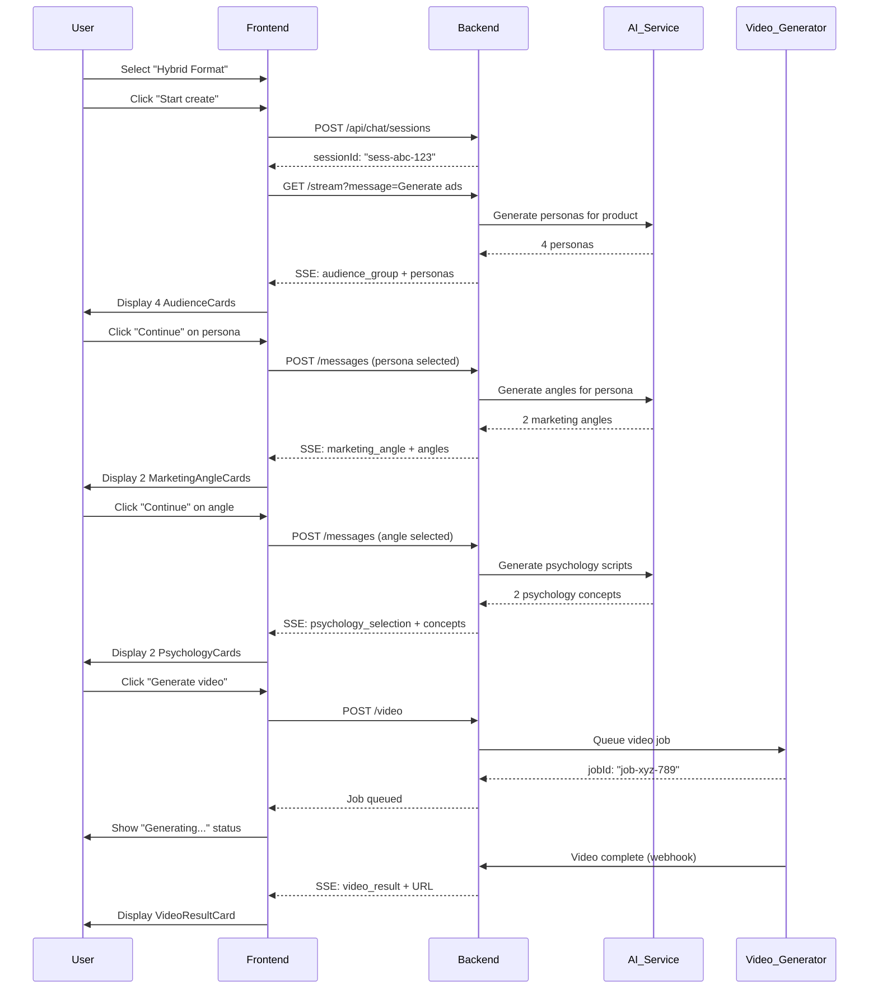

# Chat-Based Frontend to Backend Integration Guide

## Overview

This document outlines the integration strategy for connecting the new **chat-based frontend** with the existing backend API. The frontend has evolved from simple page-based interactions to a conversational chat interface that requires real-time data flow and state management.

---

## Architecture Comparison

### Previous Architecture (Simple Pages)
```
User Action → Button Click → API Call → Page Update
```
- Direct form submissions
- Synchronous page transitions
- Simple request/response pattern

### New Architecture (Chat-Based)
```
User Message → Chat State → Backend Processing → Streaming Response → Chat Update
```
- Conversational flow with context
- Asynchronous message streaming
- Multi-step workflows with state preservation

---

## Key Integration Points

### 1. Chat Message Format

#### Frontend Message Structure
```typescript
interface ChatMessage {
  id: string;
  sender: 'user' | 'ai';
  type: 'text' | 'user_selection' | 'audience_group' | 'marketing_angle' | 
        'psychology_selection' | 'video_result' | 'static_ad_result' | 'selection_summary';
  content?: string;
  data?: any; // Varies by type
  timestamp: Date;
}
```

#### Backend API Payload
```json
{
  "sessionId": "uuid",
  "message": "User message content",
  "context": {
    "selectedProduct": "product-id",
    "selectedFormat": "format-name",
    "selectedMedia": "video|image",
    "conversationHistory": [...],
    "currentStep": "persona_selection|angle_selection|script_generation|..."
  },
  "metadata": {
    "timestamp": "ISO8601",
    "userId": "user-id"
  }
}
```

---

## Complete Data Flow Example (Real Scenario)

### Scenario: Creating a Video Ad for "Sérum autobronzant progressif"

This example traces the entire data flow from the moment a user clicks "Start create" to receiving the final video result.

#### **Step 0: Initial State**

**Frontend State:**
```typescript
{
  messages: [],
  selectedProduct: "1", // Sérum autobronzant progressif
  selectedFormat: "Hybrid Format",
  selectedMedia: "video",
  sessionId: null
}
```

---

#### **Step 1: User Initiates Chat** ⚡

**User Action:**
- User selects "Hybrid Format" from format selector
- User clicks "Start create" button

**Frontend Sends:**
```typescript
// 1. Create session
POST /api/chat/sessions
{
  "userId": "user-123",
  "productId": "1",
  "format": "Hybrid Format",
  "mediaType": "video"
}
```

**Backend Response:**
```json
{
  "sessionId": "sess-abc-123",
  "status": "active",
  "createdAt": "2026-02-08T14:30:00Z"
}
```

**Frontend State Update:**
```typescript
// User message added to chat
messages: [
  {
    id: "msg-001",
    sender: "user",
    type: "text",
    content: "Generate ads for Sérum autobronzant progressif",
    timestamp: "2026-02-08T14:30:01Z"
  }
]

sessionId: "sess-abc-123"
```

---

#### **Step 2: Audience Generation** 🎯

**Frontend Triggers:**
```typescript
handleSendMessage("Generate ads for Sérum autobronzant progressif")
```

**Frontend Sends (SSE Request):**
```
GET /api/chat/sessions/sess-abc-123/stream?message=Generate%20ads&step=persona_selection
```

**Backend SSE Stream Response:**

```json
// Event 1: Start
data: {"type":"ai_response_start","messageId":"msg-002"}

// Event 2: Status update (hidden in current UI)
data: {"type":"status_update","data":{"label":"Analyzing market trends and competitor keywords...","status":"loading"}}

// Event 3: Reasoning (hidden in current UI)
data: {"type":"reasoning","data":{"reasoning":["Based on recent data, SELF-CARE is a top-performing category for your audience.","Your competitors are focusing on quick fixes, so we should highlight long-term stability."]}}

// Event 4: Audience cards
data: {
  "type": "audience_group",
  "messageId": "msg-002",
  "data": {
    "productName": "Sérum autobronzant progressif",
    "audiences": [
      {
        "id": "aud-1",
        "name": "Women Perimenopausal",
        "avatar": "https://images.unsplash.com/photo-1544005313-94ddf0286df2",
        "label": "Secondary (15-20%)",
        "labelColor": "#06E8DC",
        "age": "45-65",
        "gender": "Female",
        "location": "United States",
        "description": "Women experiencing perimenopause and menopause who face new vaginal health challenges...",
        "traits": ["hormonal changes", "evidence-seeking", "long-term health focused"],
        "painPoints": [
          "Dryness and pH changes from menopause",
          "Skeptical after trying multiple failed solutions",
          "Concerned about side effects and ingredient quality"
        ],
        "features": []
      },
      {
        "id": "aud-2",
        "name": "College Students",
        "avatar": "https://images.unsplash.com/photo-1494790108377",
        "label": "Secondary (15-20%)",
        "labelColor": "#06E8DC",
        "age": "18-24",
        "gender": "Female",
        "description": "Young women experiencing their first BV or yeast infection episodes...",
        "traits": ["digital-native", "price-conscious", "seeking quick fixes"],
        "painPoints": [...],
        "features": []
      }
      // ... 2 more personas
    ]
  }
}

// Event 5: Complete
data: {"type":"ai_response_complete","messageId":"msg-002"}
```

**Frontend State Update:**
```typescript
messages: [
  // Previous user message
  {
    id: "msg-001",
    sender: "user",
    type: "text",
    content: "Generate ads for Sérum autobronzant progressif"
  },
  // New AI response with personas
  {
    id: "msg-002",
    sender: "ai",
    type: "audience_group",
    timestamp: "2026-02-08T14:30:03Z",
    data: {
      productName: "Sérum autobronzant progressif",
      audiences: [/* 4 personas as shown above */]
    }
  }
]

// UI renders 4 AudienceCard components
```

---

#### **Step 3: User Selects Persona** 👤

**User Action:**
- User clicks "Continue with this persona" on "Women Perimenopausal" card

**Frontend Triggers:**
```typescript
handleAudienceSelection("Women Perimenopausal")
```

**Frontend Sends:**
```typescript
POST /api/chat/sessions/sess-abc-123/messages
{
  "message": "Selected persona: Women Perimenopausal",
  "currentStep": "angle_selection",
  "context": {
    "selectedPersona": {
      "id": "aud-1",
      "name": "Women Perimenopausal",
      "age": "45-65",
      "gender": "Female"
    }
  }
}
```

**Frontend State Update (Local):**
```typescript
// User selection message
messages: [
  // ... previous messages
  {
    id: "msg-003",
    sender: "user",
    type: "text",
    timestamp: "2026-02-08T14:30:15Z",
    data: {
      isSelection: true,
      label: "Target",
      value: "Women Perimenopausal"
    }
  }
]
```

**Backend SSE Stream Response:**

```json
// Event 1: Status update (hidden)
data: {
  "type": "status_update",
  "data": {
    "steps": [
      {
        "label": "Analyzing marketing angles for Women Perimenopausal...",
        "status": "loading",
        "estimatedTime": "2-3min"
      }
    ]
  }
}

// Event 2: Completed status (hidden)
data: {
  "type": "status_update",
  "data": {
    "steps": [
      {"label": "Analyzing marketing angles...", "status": "loading"},
      {"label": "Analyze Completed", "status": "completed"}
    ]
  }
}

// Event 3: Marketing angles
data: {
  "type": "marketing_angle",
  "messageId": "msg-004",
  "data": {
    "angles": [
      {
        "id": "ang-1",
        "title": "Angle 1: Balance vs Mask",
        "score": "9.3",
        "description": "Stop covering up odor with fragrances and wipes that irritate - start maintaining your natural pH balance from the inside out with probiotics",
        "metrics": {
          "emotion": "9.0",
          "proof": "9.0",
          "differentiation": "9.5"
        },
        "reason": "This angle works because it addresses the root cause..."
      },
      {
        "id": "ang-2",
        "title": "Angle 2: Antibiotic Yo-Yo Escape",
        "score": "8.8",
        "description": "Break the vicious cycle of antibiotics...",
        "metrics": {
          "emotion": "9.0",
          "proof": "9.0",
          "differentiation": "9.5"
        }
      }
    ]
  }
}
```

**Frontend State Update:**
```typescript
messages: [
  // ... previous messages
  {
    id: "msg-004",
    sender: "ai",
    type: "marketing_angle",
    timestamp: "2026-02-08T14:30:18Z",
    data: {
      angles: [/* 2 angles as shown above */]
    }
  }
]

// UI renders 2 MarketingAngleCard components
```

---

#### **Step 4: User Selects Angle** 📐

**User Action:**
- User clicks "Continue with this angle" on "Angle 1: Balance vs Mask"

**Frontend Triggers:**
```typescript
handleAngleSelection("Angle 1 : Balance vs Mask")
```

**Frontend Sends:**
```typescript
POST /api/chat/sessions/sess-abc-123/messages
{
  "message": "Selected angle: Angle 1 : Balance vs Mask",
  "currentStep": "script_generation",
  "context": {
    "selectedPersona": "Women Perimenopausal",
    "selectedAngle": {
      "id": "ang-1",
      "title": "Angle 1 : Balance vs Mask",
      "score": "9.3"
    }
  }
}
```

**Backend SSE Stream Response:**

```json
// Event 1: Status (hidden)
data: {
  "type": "status_update",
  "data": {
    "steps": [
      {"label": "Generating psychology-optimized scripts...", "status": "loading"}
    ]
  }
}

// Event 2: Psychology concepts with scripts
data: {
  "type": "psychology_selection",
  "messageId": "msg-006",
  "data": {
    "productName": "Sérum autobronzant progressif",
    "formatName": "Hybrid Format",
    "concepts": [
      {
        "id": "psych-1",
        "title": "Loss Aversion",
        "score": "7.8/10",
        "description": "Stop covering up odor with fragrances and wipes that irritate - start maintaining your natural pH balance from the inside out with probiotics",
        "hook": "Wait-if your pH is off, no amount of washing will fix that smell...",
        "metrics": {
          "hook": "9.0",
          "mechanism": "8.5",
          "believability": "6.5",
          "cta": "7.5"
        }
      },
      {
        "id": "psych-2",
        "title": "Aspiration",
        "score": "7.8/10",
        "description": "Wait—before you buy another feminine product, you need to hear this truth first...",
        "hook": "Wait—before you buy another feminine product, you need to..",
        "metrics": {
          "hook": "9.0",
          "mechanism": "8.5",
          "believability": "6.5",
          "cta": "7.5"
        }
      }
    ]
  }
}
```

**Frontend State Update:**
```typescript
messages: [
  // ... previous messages
  {
    id: "msg-005",
    sender: "user",
    type: "text",
    data: {
      isSelection: true,
      label: "Angle",
      value: "Angle 1 : Balance vs Mask"
    }
  },
  {
    id: "msg-006",
    sender: "ai",
    type: "psychology_selection",
    timestamp: "2026-02-08T14:30:25Z",
    data: {
      productName: "Sérum autobronzant progressif",
      formatName: "Hybrid Format",
      concepts: [/* 2 psychology concepts */]
    }
  }
]

// UI renders 2 PsychologyCard components
```

---

#### **Step 5: User Views Script Details** 📄

**User Action:**
- User clicks "See script details" on "Loss Aversion" card

**Frontend Action (Modal):**
```typescript
// Opens ScriptDetailsModal (client-side only, no API call)
setIsModalOpen(true)

// Modal displays:
{
  title: "Loss Aversion",
  fullScript: "Stop covering up odor with fragrances...",
  callToAction: "Wait-if your pH is off...",
  hook: "Wait-if your pH is off...",
  visualDirection: "Stop covering up odor...",
  metrics: {
    hook: "9.0",
    mechanism: "8.5",
    believability: "6.5",
    cta: "7.5"
  }
}
```

**No Backend Call** - All data already loaded in frontend state

---

#### **Step 6: User Generates Video** 🎬

**User Action:**
- User clicks "Generate video" button on "Loss Aversion" card

**Frontend Triggers:**
```typescript
handleGenerateVideo("psych-1")
```

**Frontend Sends:**
```typescript
POST /api/chat/sessions/sess-abc-123/video
{
  "scriptId": "psych-1",
  "context": {
    "product": "Sérum autobronzant progressif",
    "persona": "Women Perimenopausal",
    "angle": "Angle 1 : Balance vs Mask",
    "psychology": "Loss Aversion",
    "script": {
      "hook": "Wait-if your pH is off, no amount of washing will fix that smell...",
      "body": "Stop covering up odor with fragrances and wipes that irritate...",
      "cta": "Start maintaining your natural pH balance"
    }
  },
  "avatar": null // or avatar ID if selected
}
```

**Backend Response (Async Job):**
```json
{
  "jobId": "job-xyz-789",
  "status": "queued",
  "estimatedTime": "40s"
}
```

**Frontend State Update:**
```typescript
messages: [
  // ... previous messages
  {
    id: "msg-007",
    sender: "user",
    type: "text",
    data: {
      isSelection: true,
      label: "Script",
      value: "Loss Aversion"
    }
  },
  {
    id: "msg-008",
    sender: "ai",
    type: "status_update",
    timestamp: "2026-02-08T14:30:45Z",
    data: {
      label: "Generating your AI Video...",
      status: "loading",
      estimatedTime: "40s"
    }
  }
]

isGenerating: true
```

**Backend Processing (Polling or Webhook):**

After 40 seconds, backend completes video generation:

```json
// Webhook callback or polling result
{
  "jobId": "job-xyz-789",
  "status": "completed",
  "result": {
    "videoUrl": "https://cdn.adforge.com/videos/sess-abc-123-psych-1.mp4",
    "thumbnailUrl": "https://cdn.adforge.com/thumbnails/sess-abc-123-psych-1.jpg",
    "duration": 40,
    "format": "mp4",
    "resolution": "1080x1920"
  }
}
```

**Frontend Final State Update:**
```typescript
messages: [
  // ... previous messages
  // Update status to completed (hidden)
  {
    id: "msg-008",
    data: {
      label: "Generating your AI Video...",
      status: "completed" // ← updated
    }
  },
  // Add video result
  {
    id: "msg-009",
    sender: "ai",
    type: "video_result",
    timestamp: "2026-02-08T14:31:25Z",
    data: {
      productName: "Ad Forges AI",
      extraInfo: "40s",
      videoUrl: "https://cdn.adforge.com/videos/sess-abc-123-psych-1.mp4",
      thumbnailUrl: "https://cdn.adforge.com/thumbnails/sess-abc-123-psych-1.jpg"
    }
  }
]

isGenerating: false
```

**UI Renders:**
- VideoResultCard component with playable video

---

### Complete Request/Response Sequence



---

### Data Structure Evolution Through Workflow

**After Format Selection:**
```typescript
{
  selectedFormat: "Hybrid Format",
  selectedProduct: "1",
  selectedMedia: "video"
}
```

**After Persona Selection:**
```typescript
{
  selectedFormat: "Hybrid Format",
  selectedProduct: "1",
  selectedMedia: "video",
  selectedPersona: {
    id: "aud-1",
    name: "Women Perimenopausal",
    // ... full persona object
  }
}
```

**After Angle Selection:**
```typescript
{
  selectedFormat: "Hybrid Format",
  selectedProduct: "1",
  selectedMedia: "video",
  selectedPersona: { /* ... */ },
  selectedAngle: {
    id: "ang-1",
    title: "Angle 1 : Balance vs Mask",
    score: "9.3"
  }
}
```

**After Script Selection:**
```typescript
{
  selectedFormat: "Hybrid Format",
  selectedProduct: "1",
  selectedMedia: "video",
  selectedPersona: { /* ... */ },
  selectedAngle: { /* ... */ },
  selectedPsychology: {
    id: "psych-1",
    title: "Loss Aversion",
    metrics: { /* ... */ }
  }
}
```

---

### Current Frontend Message Types & Rendering

| Message Type | Trigger | Renders Component | Data Required |
|-------------|---------|------------------|---------------|
| `text` | User input | Text bubble | `content: string` |
| `audience_group` | After format selection | `AudienceCard` × N | `audiences: Audience[]` |
| `marketing_angle` | After persona selection | `MarketingAngleCard` × N | `angles: MarketingAngle[]` |
| `psychology_selection` | After angle selection | `PsychologyCard` × N | `concepts: PsychologyConcept[]` |
| `video_result` | After video generation | `VideoResultCard` | `videoUrl, thumbnailUrl` |
| `static_ad_result` | Image mode result | `StaticAdResult` | `imageUrl` |
| `selection_summary` | User selection badge | `SelectedMessagesBadge` | `images: string[]` |
| `status_update` | Processing indicator | Hidden (commented out) | `label, status` |
| `reasoning` | AI explanation | Hidden (commented out) | `reasoning: string[]` |

---

### Frontend Component Hierarchy for Chat Messages

```
HomePage
├─ ChatMessage (user text)
│  └─ UserSelectionMessage (if isSelection)
│
├─ AIResponseHeader (if AI message)
│  ├─ Ad Forge Logo
│  ├─ Product Badge
│  └─ Format Badge
│
├─ AudienceCard[] (if type: audience_group)
│  ├─ Avatar Image
│  ├─ Name + Age/Gender
│  ├─ Description
│  ├─ Key Traits
│  ├─ Pain Points
│  └─ "Continue with this persona" button
│
├─ MarketingAngleCard[] (if type: marketing_angle)
│  ├─ Title + Score
│  ├─ Description
│  ├─ Metrics (Emotion, Proof, Differentiation)
│  └─ "Continue with this angle" button
│
├─ PsychologyCard[] (if type: psychology_selection)
│  ├─ Title + Score
│  ├─ Script Preview + Hook
│  ├─ Metrics (Hook, Mechanism, Believability, CTA)
│  ├─ "See script details" button → Opens ScriptDetailsModal
│  └─ "Generate video" button
│
└─ VideoResultCard (if type: video_result)
   ├─ Video Player
   ├─ Thumbnail
   └─ Duration info
```

---

## Step-by-Step Integration

### Step 1: Create Chat Session Management

**Backend Endpoint Required:**
```
POST /api/chat/sessions
```

**Request:**
```json
{
  "userId": "user-123",
  "productId": "product-456",
  "format": "Hybrid Format",
  "mediaType": "video"
}
```

**Response:**
```json
{
  "sessionId": "session-789",
  "status": "active",
  "createdAt": "2026-02-08T12:00:00Z"
}
```

**Frontend Implementation:**
```typescript
// When user starts a new chat
const startNewChat = async (productId: string, format: string) => {
  const response = await fetch('/api/chat/sessions', {
    method: 'POST',
    headers: { 'Content-Type': 'application/json' },
    body: JSON.stringify({
      userId: currentUser.id,
      productId,
      format,
      mediaType: selectedMedia
    })
  });
  
  const { sessionId } = await response.json();
  setCurrentSessionId(sessionId);
};
```

---

### Step 2: Message Sending & Processing

**Backend Endpoint Required:**
```
POST /api/chat/sessions/:sessionId/messages
```

**Request:**
```json
{
  "message": "I want to target women experiencing menopause",
  "currentStep": "persona_selection",
  "selections": {
    "product": "serum-autobronzant",
    "format": "Hybrid Format",
    "media": "video"
  }
}
```

**Response (Streaming):**
```json
// Stream of events via Server-Sent Events (SSE)
{
  "type": "ai_response_start",
  "messageId": "msg-123"
}

{
  "type": "audience_group",
  "data": {
    "audiences": [
      {
        "id": "persona-1",
        "name": "Women Perimenopausal",
        "ageRange": "45-55",
        "gender": "Female",
        "category": "Primary (40-60%)",
        "description": "Women experiencing perimenopause...",
        "keyTraits": [...],
        "painPoints": [...],
        "desires": [...]
      },
      // ... more personas
    ]
  }
}

{
  "type": "ai_response_complete",
  "messageId": "msg-123"
}
```

**Frontend Implementation:**
```typescript
const sendMessage = async (message: string) => {
  // Add user message to chat
  const userMessage: ChatMessage = {
    id: generateId(),
    sender: 'user',
    type: 'text',
    content: message,
    timestamp: new Date()
  };
  setMessages(prev => [...prev, userMessage]);

  // Send to backend with SSE
  const eventSource = new EventSource(
    `/api/chat/sessions/${sessionId}/messages?message=${encodeURIComponent(message)}`
  );

  eventSource.onmessage = (event) => {
    const data = JSON.parse(event.data);
    
    switch(data.type) {
      case 'audience_group':
        const aiMessage: ChatMessage = {
          id: data.messageId,
          sender: 'ai',
          type: 'audience_group',
          data: data.data,
          timestamp: new Date()
        };
        setMessages(prev => [...prev, aiMessage]);
        break;
      
      case 'ai_response_complete':
        eventSource.close();
        break;
    }
  };
};
```

---

### Step 3: Workflow State Management

The chat follows a multi-step workflow. Backend needs to track current step and provide appropriate responses.

**Workflow Steps:**

1. **Format Selection** → Backend returns format options
2. **Persona Selection** → Backend analyzes product and returns personas
3. **Persona Impact** → Backend explains selection impact
4. **Angle Selection** → Backend generates marketing angles
5. **Psychology Selection** → Backend generates psychology concepts with scripts
6. **Script Details** → Backend provides full script breakdown
7. **Video Generation** → Backend triggers video creation

**Backend State Tracking:**
```python
# Example session state in database/cache
{
  "sessionId": "session-789",
  "currentStep": "angle_selection",
  "selections": {
    "product": "product-456",
    "format": "Hybrid Format",
    "persona": "Women Perimenopausal",
    "personaImpact": {...},
    "angle": "Loss Aversion"
  },
  "context": {
    "previousResponses": [...],
    "generatedContent": {...}
  }
}
```

---

### Step 4: Data Transformation Mapping

#### Persona Selection

**Old Frontend (Simple):**
```javascript
// Direct API call
fetch('/api/personas?product=123')
```

**New Frontend (Chat):**
```javascript
// Chat message triggers backend to:
// 1. Analyze user's product
// 2. Generate personas
// 3. Return as chat message
sendMessage("I want to create ads for this product")
```

**Backend Transformation:**
```python
@app.post("/api/chat/sessions/{session_id}/messages")
async def process_chat_message(session_id: str, message: ChatMessageInput):
    # Get session context
    session = get_session(session_id)
    
    # Determine current step
    if session.current_step == "persona_selection":
        # Call existing persona generation logic
        personas = await generate_personas(
            product_id=session.selections.product,
            format=session.selections.format
        )
        
        # Transform to chat response format
        return StreamingResponse(
            generate_sse_response({
                "type": "audience_group",
                "data": {
                    "audiences": transform_personas_to_chat_format(personas)
                }
            })
        )
```

#### Script Generation

**Data Flow:**
```
Frontend Selection → Backend Processing → AI Generation → Response
```

**Backend Implementation:**
```python
async def generate_psychology_scripts(
    persona: str,
    angle: str,
    product: dict,
    format: str
) -> List[PsychologyScript]:
    # Call AI service
    scripts = await ai_service.generate_scripts(
        persona=persona,
        angle=angle,
        product_details=product,
        format=format
    )
    
    # Transform to frontend format
    return [
        {
            "id": script.id,
            "title": script.concept_name,
            "description": script.preview,
            "hook": script.hook_text,
            "score": calculate_score(script),
            "metrics": {
                "hook": script.metrics.hook_score,
                "mechanism": script.metrics.mechanism_score,
                "believability": script.metrics.believability,
                "cta": script.metrics.cta_score
            }
        }
        for script in scripts
    ]
```

---

### Step 5: Real-Time Streaming (SSE)

**Why Streaming?**
- AI generation takes time (3-10 seconds)
- Users need progress feedback
- Better UX with incremental updates

**Backend SSE Implementation (Python FastAPI):**
```python
from fastapi.responses import StreamingResponse
import asyncio

async def generate_chat_response(session_id: str, message: str):
    session = get_session(session_id)
    
    # Start response
    yield f"data: {json.dumps({'type': 'ai_response_start'})}\n\n"
    
    # Processing step
    yield f"data: {json.dumps({'type': 'status_update', 'status': 'analyzing'})}\n\n"
    
    # Generate content
    result = await ai_service.generate(session, message)
    
    # Send result
    yield f"data: {json.dumps({'type': 'audience_group', 'data': result})}\n\n"
    
    # Complete
    yield f"data: {json.dumps({'type': 'ai_response_complete'})}\n\n"

@app.get("/api/chat/sessions/{session_id}/stream")
async def stream_response(session_id: str, message: str):
    return StreamingResponse(
        generate_chat_response(session_id, message),
        media_type="text/event-stream"
    )
```

**Frontend SSE Consumption:**
```typescript
const connectToStream = (sessionId: string, message: string) => {
  const eventSource = new EventSource(
    `/api/chat/sessions/${sessionId}/stream?message=${encodeURIComponent(message)}`
  );

  eventSource.addEventListener('message', (event) => {
    const data = JSON.parse(event.data);
    handleStreamEvent(data);
  });

  eventSource.addEventListener('error', () => {
    eventSource.close();
  });

  return eventSource;
};
```

---

### Step 6: Context & History Management

**Frontend Context Storage:**
```typescript
interface ChatContext {
  sessionId: string;
  selectedProduct: string;
  selectedFormat: string | null;
  selectedMedia: 'video' | 'image';
  selectedPersona?: Audience;
  selectedAngle?: MarketingAngle;
  selectedPsychology?: PsychologyConcept;
  conversationHistory: ChatMessage[];
}
```

**Backend Context Retrieval:**
```python
def get_conversation_context(session_id: str) -> dict:
    """Retrieve full conversation context for AI processing"""
    session = db.sessions.find_one({"id": session_id})
    
    return {
        "product": get_product_details(session.product_id),
        "format": session.format,
        "selections": session.selections,
        "history": [
            {
                "role": msg.sender,
                "content": msg.content,
                "timestamp": msg.timestamp
            }
            for msg in session.messages
        ]
    }
```

---

## API Endpoints Required

### Core Chat Endpoints

| Endpoint | Method | Purpose |
|----------|--------|---------|
| `/api/chat/sessions` | POST | Create new chat session |
| `/api/chat/sessions/:id` | GET | Get session details |
| `/api/chat/sessions/:id/messages` | POST | Send message (non-streaming) |
| `/api/chat/sessions/:id/stream` | GET | SSE streaming endpoint |
| `/api/chat/sessions/:id/context` | GET | Get current context |

### Workflow-Specific Endpoints

| Endpoint | Method | Purpose |
|----------|--------|---------|
| `/api/personas/generate` | POST | Generate personas for product |
| `/api/angles/generate` | POST | Generate marketing angles |
| `/api/scripts/generate` | POST | Generate psychology scripts |
| `/api/videos/generate` | POST | Trigger video generation |
| `/api/avatars/marketplace` | GET | Get available AI avatars |

---

## Data Format Examples

### Example 1: Persona Selection Flow

**Frontend Sends:**
```json
{
  "sessionId": "sess-123",
  "message": "Show me target audiences for this product",
  "context": {
    "product": "serum-autobronzant",
    "format": "Hybrid Format"
  }
}
```

**Backend Responds:**
```json
{
  "type": "audience_group",
  "messageId": "msg-456",
  "data": {
    "productName": "Sérum autobronzant progressif",
    "audiences": [
      {
        "id": "aud-1",
        "name": "Women Perimenopausal",
        "ageRange": "45-55",
        "gender": "Female",
        "category": "Primary (40-60%)",
        "description": "Women experiencing perimenopause and menopause...",
        "keyTraits": [
          "hormonal changes",
          "evidence-seeking",
          "long-term health focused"
        ],
        "painPoints": [
          "Dryness and pH changes from menopause",
          "Skeptical after trying multiple failed solutions",
          "Concerned about side effects and ingredient safety"
        ],
        "desires": [
          "Gentle, science-backed care for changing skin",
          "Transparent product info and proven results"
        ]
      }
      // ... more personas
    ]
  }
}
```

### Example 2: Script Generation Flow

**Frontend Sends:**
```json
{
  "sessionId": "sess-123",
  "message": "Generate scripts",
  "context": {
    "product": "serum-autobronzant",
    "persona": "Women Perimenopausal",
    "angle": "Loss Aversion"
  }
}
```

**Backend Responds:**
```json
{
  "type": "psychology_selection",
  "data": {
    "concepts": [
      {
        "id": "psych-1",
        "title": "Loss Aversion",
        "score": "9.2",
        "description": "Stop covering up odor with fragrances...",
        "hook": "Want if your pH is off, no amount of washing...",
        "metrics": {
          "hook": "9.0",
          "mechanism": "8.5",
          "believability": "8.5",
          "cta": "7.5"
        }
      }
      // ... more concepts
    ]
  }
}
```

### Example 3: Video Generation Request

**Frontend Sends:**
```json
{
  "sessionId": "sess-123",
  "action": "generate_video",
  "scriptId": "psych-1",
  "avatarId": "avatar-female-45",
  "context": {
    "persona": "Women Perimenopausal",
    "angle": "Loss Aversion",
    "script": "Full script text here..."
  }
}
```

**Backend Processing:**
```json
{
  "type": "video_generation_started",
  "jobId": "job-999",
  "estimatedTime": "120s"
}

// ... later via webhook or polling ...

{
  "type": "video_result",
  "data": {
    "videoUrl": "https://cdn.example.com/videos/generated-123.mp4",
    "thumbnailUrl": "https://cdn.example.com/thumbnails/thumb-123.jpg",
    "duration": 45,
    "status": "ready"
  }
}
```

---

## Implementation Steps

### Phase 1: Basic Chat Infrastructure

1. **Create Session Management**
   - Endpoint: `POST /api/chat/sessions`
   - Store: sessionId, userId, productId, format, mediaType
   - Return: sessionId for subsequent requests

2. **Message Storage**
   - Endpoint: `POST /api/chat/sessions/:id/messages`
   - Store: All messages (user + AI) with timestamps
   - Enable context retrieval for AI processing

3. **Context API**
   - Endpoint: `GET /api/chat/sessions/:id/context`
   - Return: Full conversation context for AI

### Phase 2: Streaming Responses

1. **Setup SSE Endpoint**
   ```python
   @app.get("/api/chat/sessions/{session_id}/stream")
   async def stream_chat(session_id: str, message: str):
       async def event_generator():
           # Yield events as they happen
           yield sse_event("status_update", {"status": "processing"})
           
           result = await process_message(session_id, message)
           
           yield sse_event("audience_group", result)
           yield sse_event("complete", {})
       
       return StreamingResponse(event_generator(), media_type="text/event-stream")
   ```

2. **Frontend SSE Handler**
   ```typescript
   const handleStreamingResponse = (sessionId: string, message: string) => {
     const eventSource = new EventSource(`/api/chat/sessions/${sessionId}/stream?message=${message}`);
     
     eventSource.onmessage = (event) => {
       const data = JSON.parse(event.data);
       
       // Route to appropriate handler based on type
       switch(data.type) {
         case 'audience_group':
           addAIMessage('audience_group', data.data);
           break;
         case 'marketing_angle':
           addAIMessage('marketing_angle', data.data);
           break;
         // ... etc
       }
     };
   };
   ```

### Phase 3: Workflow Handlers

1. **Persona Generation Handler**
   ```python
   async def handle_persona_selection(session: Session, message: str):
       # Get product details
       product = get_product(session.product_id)
       
       # Generate personas using AI
       personas = await ai_service.generate_personas(
           product=product,
           format=session.format,
           target_demographics=extract_demographics(message)
       )
       
       # Update session state
       update_session_step(session.id, "persona_selected")
       
       return {
           "type": "audience_group",
           "data": {
               "productName": product.name,
               "audiences": personas
           }
       }
   ```

2. **Angle Generation Handler**
   ```python
   async def handle_angle_selection(session: Session, selected_persona: str):
       # Generate angles based on persona
       angles = await ai_service.generate_angles(
           persona=selected_persona,
           product=get_product(session.product_id),
           format=session.format
       )
       
       return {
           "type": "marketing_angle",
           "data": {
               "angles": angles
           }
       }
   ```

3. **Script Generation Handler**
   ```python
   async def handle_script_generation(session: Session, selected_angle: str):
       # Generate psychology-based scripts
       scripts = await ai_service.generate_scripts(
           persona=session.selections.persona,
           angle=selected_angle,
           product=get_product(session.product_id)
       )
       
       return {
           "type": "psychology_selection",
           "data": {
               "concepts": scripts
           }
       }
   ```

---

## Error Handling

### Frontend Error Handling

```typescript
const sendMessage = async (message: string) => {
  try {
    const response = await fetch(`/api/chat/sessions/${sessionId}/messages`, {
      method: 'POST',
      body: JSON.stringify({ message })
    });
    
    if (!response.ok) {
      throw new Error(`HTTP ${response.status}`);
    }
    
    // Handle response
  } catch (error) {
    // Show error message in chat
    const errorMessage: ChatMessage = {
      id: generateId(),
      sender: 'ai',
      type: 'error',
      content: 'Sorry, something went wrong. Please try again.',
      timestamp: new Date()
    };
    setMessages(prev => [...prev, errorMessage]);
  }
};
```

### Backend Error Responses

```python
@app.exception_handler(AIGenerationError)
async def ai_error_handler(request: Request, exc: AIGenerationError):
    return JSONResponse(
        status_code=500,
        content={
            "type": "error",
            "message": "AI generation failed. Please try again.",
            "code": "AI_GENERATION_ERROR",
            "retryable": True
        }
    )
```

---

## WebSocket Alternative (Optional)

For bidirectional real-time communication:

**Backend WebSocket Setup:**
```python
from fastapi import WebSocket

@app.websocket("/ws/chat/{session_id}")
async def websocket_chat(websocket: WebSocket, session_id: str):
    await websocket.accept()
    
    try:
        while True:
            # Receive message
            data = await websocket.receive_json()
            
            # Process
            response = await process_chat_message(session_id, data)
            
            # Send response
            await websocket.send_json(response)
    except WebSocketDisconnect:
        print(f"Client disconnected: {session_id}")
```

**Frontend WebSocket:**
```typescript
const ws = new WebSocket(`ws://localhost:8000/ws/chat/${sessionId}`);

ws.onmessage = (event) => {
  const data = JSON.parse(event.data);
  handleChatMessage(data);
};

ws.send(JSON.stringify({
  message: "Generate personas",
  context: {...}
}));
```

---

## Database Schema Updates

### Chat Sessions Table

```sql
CREATE TABLE chat_sessions (
    id UUID PRIMARY KEY,
    user_id UUID NOT NULL,
    product_id UUID NOT NULL,
    format VARCHAR(100),
    media_type VARCHAR(20),
    current_step VARCHAR(50),
    selections JSONB,
    context JSONB,
    status VARCHAR(20),
    created_at TIMESTAMP DEFAULT NOW(),
    updated_at TIMESTAMP DEFAULT NOW()
);
```

### Chat Messages Table

```sql
CREATE TABLE chat_messages (
    id UUID PRIMARY KEY,
    session_id UUID REFERENCES chat_sessions(id),
    sender VARCHAR(10), -- 'user' or 'ai'
    message_type VARCHAR(50),
    content TEXT,
    data JSONB,
    timestamp TIMESTAMP DEFAULT NOW()
);

CREATE INDEX idx_messages_session ON chat_messages(session_id);
CREATE INDEX idx_messages_timestamp ON chat_messages(timestamp);
```

---

## Testing Strategy

### 1. Unit Tests

```python
# Test persona generation
def test_persona_generation():
    result = await generate_personas(
        product_id="prod-123",
        format="Hybrid Format"
    )
    
    assert len(result) >= 2
    assert all(p.get("name") for p in result)
    assert all(p.get("ageRange") for p in result)
```

### 2. Integration Tests

```python
def test_chat_workflow():
    # 1. Create session
    session = create_session(user_id="user-1", product_id="prod-1")
    
    # 2. Send message
    response = send_message(session.id, "Generate personas")
    
    # 3. Verify response format
    assert response["type"] == "audience_group"
    assert "audiences" in response["data"]
```

### 3. E2E Tests

```typescript
// Cypress test
describe('Chat Workflow', () => {
  it('should complete full creative generation flow', () => {
    cy.visit('/');
    
    // Select format
    cy.contains('Select a format to start').click();
    cy.contains('Hybrid Format').click();
    
    // Send message
    cy.get('textarea').type('Generate ads for my product');
    cy.get('button[type="submit"]').click();
    
    // Wait for personas
    cy.contains('Women Perimenopausal', { timeout: 10000 }).should('be.visible');
    
    // Continue workflow...
  });
});
```

---

## Migration Checklist

- [ ] **Backend Setup**
  - [ ] Create chat session management endpoints
  - [ ] Implement SSE/WebSocket streaming
  - [ ] Add context storage and retrieval
  - [ ] Create workflow step handlers
  
- [ ] **Data Transformation**
  - [ ] Map old API responses to new chat format
  - [ ] Add type safety for all message types
  - [ ] Implement data validators
  
- [ ] **Frontend Updates**
  - [ ] Integrate SSE/WebSocket listeners
  - [ ] Add chat state management
  - [ ] Implement message rendering for all types
  - [ ] Add loading and error states
  
- [ ] **Testing**
  - [ ] Unit tests for transformers
  - [ ] Integration tests for workflows
  - [ ] E2E tests for critical paths
  
- [ ] **Documentation**
  - [ ] API documentation (OpenAPI/Swagger)
  - [ ] Message type definitions
  - [ ] Deployment guide

---

## Performance Considerations

1. **Caching**
   - Cache generated personas for same product/format combo
   - Redis for session state (fast retrieval)
   - CDN for generated videos/thumbnails

2. **Rate Limiting**
   ```python
   from slowapi import Limiter
   
   limiter = Limiter(key_func=get_user_id)
   
   @app.post("/api/chat/sessions/{id}/messages")
   @limiter.limit("10/minute")
   async def send_message(...):
       pass
   ```

3. **Async Processing**
   - Queue long-running tasks (Celery/Bull)
   - Return job ID immediately
   - Update via SSE when complete

---

## Security Considerations

1. **Authentication**
   ```python
   from fastapi import Depends, HTTPException
   
   async def get_current_user(token: str = Depends(oauth2_scheme)):
       user = verify_token(token)
       if not user:
           raise HTTPException(status_code=401)
       return user
   
   @app.post("/api/chat/sessions")
   async def create_session(user = Depends(get_current_user)):
       # Only authenticated users can create sessions
       pass
   ```

2. **Session Validation**
   - Verify user owns session before processing
   - Expire inactive sessions after 24h
   - Sanitize all user inputs

3. **Rate Limiting**
   - Per-user message limits
   - Per-session generation limits
   - API key validation for external services

---

## Monitoring & Logging

```python
import logging
from datetime import datetime

logger = logging.getLogger(__name__)

async def process_chat_message(session_id: str, message: str):
    start_time = datetime.now()
    
    logger.info(f"Processing message for session {session_id}")
    
    try:
        result = await generate_response(session_id, message)
        
        duration = (datetime.now() - start_time).total_seconds()
        logger.info(f"Message processed in {duration}s")
        
        # Log metrics
        metrics.record_chat_response_time(duration)
        metrics.increment_successful_messages()
        
        return result
        
    except Exception as e:
        logger.error(f"Error processing message: {e}", exc_info=True)
        metrics.increment_failed_messages()
        raise
```

---

## Troubleshooting

### Common Issues

**Issue 1: SSE Connection Drops**
```typescript
// Add reconnection logic
let eventSource: EventSource | null = null;
let reconnectAttempts = 0;
const MAX_RECONNECTS = 3;

const connectWithRetry = (sessionId: string) => {
  eventSource = new EventSource(`/api/chat/sessions/${sessionId}/stream`);
  
  eventSource.onerror = () => {
    eventSource?.close();
    
    if (reconnectAttempts < MAX_RECONNECTS) {
      reconnectAttempts++;
      setTimeout(() => connectWithRetry(sessionId), 1000 * reconnectAttempts);
    }
  };
};
```

**Issue 2: Context Loss**
- Solution: Store session state in Redis
- Fallback: Reconstruct from message history
- Backup: Session snapshots every N messages

**Issue 3: Long Processing Times**
- Show progress indicators
- Implement timeout handling (30s max)
- Allow cancellation of generation

---

## Next Steps

1. **Immediate Actions**
   - Set up development backend with chat endpoints
   - Test SSE streaming with sample data
   - Implement session management

2. **Short Term**
   - Integrate AI service for persona generation
   - Add video generation pipeline
   - Implement caching layer

3. **Long Term**
   - Add analytics for chat interactions
   - Implement A/B testing for AI responses
   - Build admin panel for monitoring sessions

---

## Resources

- **FastAPI SSE**: https://fastapi.tiangolo.com/advanced/custom-response/#streamingresponse
- **EventSource MDN**: https://developer.mozilla.org/en-US/docs/Web/API/EventSource
- **WebSocket Guide**: https://fastapi.tiangolo.com/advanced/websockets/
- **Redis Session Storage**: https://redis.io/docs/manual/patterns/session-cache/

---

## Contact

For questions or issues with integration:
- Backend Team: backend@adforge.com
- Frontend Team: frontend@adforge.com
- DevOps: devops@adforge.com

---

**Last Updated**: February 8, 2026  
**Version**: 1.0  
**Status**: Draft - Ready for Implementation
