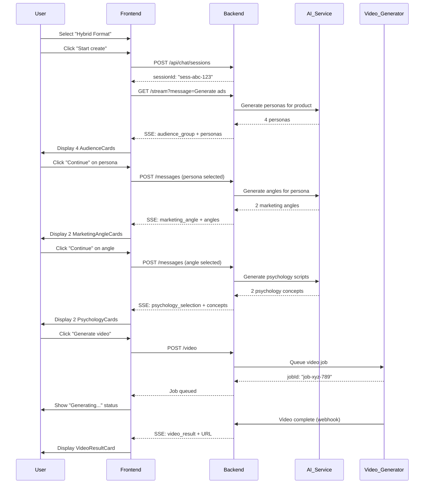

# Adforge Frontend-Backend Integration - Complete Guide

> **Comprehensive documentation consolidating the old page-based frontend architecture with the new chat-based frontend structure, highlighting differences and providing a foundation for seamless integration.**

---

## 📋 Table of Contents

1. [Executive Summary](#executive-summary)
2. [Old Architecture (Page-Based)](#old-architecture-page-based)
   - [Core Components](#old-core-components)
   - [Data Flow](#old-data-flow)
   - [Strategic Analysis Flow](#old-strategic-analysis-flow)
3. [New Architecture (Chat-Based)](#new-architecture-chat-based)
   - [Core Components](#new-core-components)
   - [Data Flow](#new-data-flow)
   - [Complete Workflow Example](#complete-workflow-example)
4. [Key Differences](#key-differences)
5. [Integration Requirements](#integration-requirements)
6. [Migration Path](#migration-path)
7. [API Endpoints Reference](#api-endpoints-reference)
8. [Best Practices](#best-practices)

---

## Executive Summary

### Old Frontend (Page-Based)
- **Pattern**: Traditional multi-page application with distinct steps
- **Navigation**: Users navigate through dedicated pages (Research → Analysis → Creatives → Video)
- **State**: Managed via `StrategicChatContext` with explicit workflow steps
- **Jobs**: Async job-based architecture with polling
- **Communication**: REST API with job polling (2-10s intervals)

### New Frontend (Chat-Based)
- **Pattern**: Conversational single-page chat interface
- **Navigation**: Linear chat flow with interactive cards
- **State**: Managed via local `useState` with message-based history
- **Jobs**: Simulated locally (needs real backend integration)
- **Communication**: Needs SSE (Server-Sent Events) or REST + polling

### Core Difference
**Old**: User explicitly navigates between pages, each page represents a workflow step.
**New**: User interacts with AI in a chat, cards appear progressively, selections trigger next steps inline.

---

## Old Architecture (Page-Based)

### Old Core Components

#### 1. **Authentication (Firebase + Backend)**

**Location**: `src/contexts/AuthContext.jsx`

**Flow**:
```
User Login (Firebase)
  ↓
Firebase ID Token Generated
  ↓
Frontend → POST /api/v1/auth/verify-token
  ↓
Backend Validates Token
  ↓
All Subsequent Requests Include: Authorization: Bearer {token}
```

**Key Features**:
- ✅ Firebase Authentication
- ✅ Automatic token refresh
- ✅ Backend token verification
- ✅ Retry logic (3 attempts)
- ✅ Session persistence (localStorage/sessionStorage)

**Public Routes (No Auth Required)**:
```
/api/v1/auth/signup
/api/v1/auth/verify-token
/api/v1/auth/login
/api/v1/auth/resend-verification
```

---

#### 2. **API Service (Axios Configuration)**

**Location**: `src/services/apiService.js`

**Two Axios Instances**:
```javascript
// 1. JSON API (Content-Type: application/json)
const api = axios.create({
  baseURL: import.meta.env.VITE_API_BASE_URL,
  timeout: 300000, // 5 minutes
  headers: {
    'Content-Type': 'application/json',
    'ngrok-skip-browser-warning': 'true'
  }
});

// 2. FormData API (for file uploads)
const apiFormData = axios.create({
  baseURL: import.meta.env.VITE_API_BASE_URL,
  timeout: 300000,
  headers: {
    'ngrok-skip-browser-warning': 'true'
    // No Content-Type - browser sets multipart/form-data with boundary
  }
});
```

**Request Interceptor** (Automatic Auth):
```javascript
api.interceptors.request.use(async (config) => {
  const isPublicRoute = publicRoutes.some(route => config.url?.includes(route));
  
  if (!isPublicRoute) {
    const user = auth.currentUser;
    if (user) {
      const token = await user.getIdToken();
      config.headers.Authorization = `Bearer ${token}`;
    }
  }
  
  return config;
});
```

**Response Interceptor** (Error Handling):
```javascript
api.interceptors.response.use(
  (response) => response.data, // Unwrap response.data
  (error) => {
    // Transform errors into user-friendly messages
    const message = error.response?.data?.message || 'Une erreur est survenue';
    const customError = new Error(message);
    customError.response = error.response;
    return Promise.reject(customError);
  }
);
```

---

#### 3. **State Management (React Context API)**

**Hierarchy**:
```
<AuthProvider>
  <BrandProvider>
    <TasksProvider>
      <JobNotificationProvider>
        <StrategicChatProvider>
          {/* App content */}
        </StrategicChatProvider>
      </JobNotificationProvider>
    </TasksProvider>
  </BrandProvider>
</AuthProvider>
```

**BrandContext** (`src/contexts/BrandContext.jsx`):
```javascript
{
  brands: Brand[],
  selectedBrand: Brand | null,
  setSelectedBrand: (brand) => void,
  brandProducts: Product[],
  brandAds: Ad[],
  loading: boolean,
  
  // Auto-loads products & ads when brand selected
  // Persists selection in sessionStorage
}
```

**TasksContext** (`src/contexts/TasksContext.jsx`):
```javascript
{
  tasks: Task[],
  addTask: (taskData) => taskId,
  updateTask: (taskId, updates) => void,
  removeTask: (taskId) => Promise<void>,
  
  // Task types: ad_generation, video_generation, scraping, avatar_video, remix
  // Task statuses: queued, processing, completed, failed, cancelled
}
```

**StrategicChatContext** (`src/contexts/StrategicChatContext.jsx`):
```javascript
{
  // Workflow
  currentStep: string, // CHAT_STEPS enum
  setCurrentStep: (step) => void,
  
  // Product context
  brandId: string | null,
  productId: string | null,
  researchId: string | null,
  
  // Analysis IDs
  analysisId: string | null,
  creativeGenId: string | null,
  videoJobId: string | null,
  
  // Selected items
  selectedAngle: Angle | null,
  selectedCreative: Creative | null,
  selectedPersona: Persona | null,
  selectedLanguage: string,
  
  // Chat messages
  messages: Message[],
  addMessage: (message) => void,
  
  // Actions
  initializeChat: (brandId, productId, researchId) => void,
  reset: () => void
}
```

**Workflow Steps**:
```javascript
export const CHAT_STEPS = {
  WAITING_FOR_RESEARCH: 'waiting_for_research',
  SHOWING_SUMMARY: 'showing_summary',
  SELECTING_PERSONA: 'selecting_persona',
  ANALYZING_ANGLES: 'analyzing_angles',
  SHOWING_ANGLES: 'showing_angles',
  GENERATING_CREATIVES: 'generating_creatives',
  SHOWING_CREATIVES: 'showing_creatives',
  GENERATING_VIDEO: 'generating_video',
  VIDEO_READY: 'video_ready',
};
```

**Message Types**:
```javascript
export const MESSAGE_TYPES = {
  TEXT: 'text',
  RESEARCH_SUMMARY: 'research_summary',
  PERSONA_SELECTOR: 'persona_selector',
  ANGLES: 'angles',
  PLATFORM_AD_LENGTH_SELECTOR: 'platform_ad_length_selector',
  CREATIVES: 'creatives',
  VIDEO: 'video',
};
```

---

#### 4. **Job Polling Pattern**

**Location**: `src/services/apiService.js`

**Why Jobs?**
- ✅ No HTTP timeouts (operations can take 30+ minutes)
- ✅ Non-blocking user experience
- ✅ Progress tracking
- ✅ Persistent (survives page refreshes)

**Generic Polling Function**:
```javascript
/**
 * Poll a job until completion
 * @param {string} jobId - The job ID to poll
 * @param {function} onProgress - Callback for progress updates
 * @param {number} pollInterval - Polling interval in ms (default: 2000)
 * @param {number} maxAttempts - Maximum polling attempts (default: 450)
 */
export async function pollJobStatus(
  jobId, 
  onProgress = null, 
  pollInterval = 2000, 
  maxAttempts = 450
) {
  let attempts = 0;

  while (attempts < maxAttempts) {
    try {
      const response = await api.get(`/api/v1/jobs/${jobId}`);
      const job = response.data || response;

      // Update progress
      if (onProgress && job.progress_data) {
        onProgress({
          percentage: job.progress_data.percentage || 0,
          message: job.progress_data.current_step || 'Processing...',
          status: job.status
        });
      }

      // Job completed
      if (job.status === 'completed') {
        return job.result_data || job.result || {};
      }

      // Job failed
      if (job.status === 'failed') {
        throw new Error(job.error_data?.message || 'Job failed');
      }

      // Still processing
      await new Promise(resolve => setTimeout(resolve, pollInterval));
      attempts++;

    } catch (error) {
      await new Promise(resolve => setTimeout(resolve, pollInterval));
      attempts++;
    }
  }

  throw new Error(`Job ${jobId} timeout`);
}
```

**Poll Intervals by Operation**:
| Operation | Interval | Max Duration | Reason |
|-----------|----------|--------------|--------|
| Scraping | 5s | 10 min | Web scraping |
| Ad generation | 6s | 30 min | Image batch |
| Video generation | 10s | 45 min | AI video |
| Research | 10s | 50 min | Deep scraping + AI |
| Strategic analysis | 10s | 90 min | Multi-module AI |

**Job Response Format**:
```javascript
{
  job_id: "job_abc123",
  status: "processing", // queued | processing | completed | failed | cancelled
  type: "video_generation",
  created_at: "2024-01-15T10:00:00Z",
  completed_at: null,
  
  // Progress tracking
  progress_data: {
    percentage: 45,
    current_step: "Generating scene 3 of 7",
    estimated_time_remaining: 120 // seconds
  },
  
  // On completion
  result_data: {
    // Job-specific results
  },
  
  // On failure
  error_data: {
    message: "Error description",
    details: {...}
  }
}
```

---

### Old Data Flow

#### Strategic Analysis Pipeline (Modules 1-5)

```
Product Scraped
   ↓
Module 1: Research (Auto-triggered)
   ↓ Extract: pain points, benefits, proof, positioning
Research Summary
   ↓
[Optional] Select Persona
   ↓
Module 2: Angle Intelligence + Offer Diagnostic
   ↓ Generate: 7 marketing angles ranked by effectiveness
Angle Selection UI
   ↓
User Selects Angle
   ↓
[Optional] Select Platform & Ad Length
   ↓
Modules 3-4: Creative Generation
   ↓ Generate: Hooks, Scripts, CTAs for 3 variations (proof, fear, desire)
Creative Variations UI
   ↓
User Selects Creative
   ↓
Module 5: Video Generation
   ↓ Generate: Kling scenes + Sora overlay
Video Ready!
```

---

### Old Strategic Analysis Flow

#### Step 1: Initialize Chat

```javascript
import { useStrategicChat } from '../contexts/StrategicChatContext';

const { initializeChat } = useStrategicChat();
const { selectedBrand } = useBrand();

useEffect(() => {
  if (selectedBrand && product && product.research_id) {
    initializeChat(
      selectedBrand.brandId,
      product.productId,
      product.research_id
    );
  }
}, [selectedBrand, product]);
```

#### Step 2: Load Research Summary

```javascript
import { researchAPI } from '../services/researchService';

async function loadResearchSummary() {
  const summary = await researchAPI.getResearchSummary(
    brandId,
    productId,
    researchId,
    selectedLanguage
  );
  
  setResearchSummary(summary);
  
  addMessage({
    type: MESSAGE_TYPES.RESEARCH_SUMMARY,
    sender: 'agent',
    content: 'Here\'s what I found about your product:',
    data: summary
  });
  
  setCurrentStep(CHAT_STEPS.SHOWING_SUMMARY);
}
```

**Backend Endpoint**:
```
GET /api/v1/research/products/{brandId}/{productId}/research/{researchId}/summary?language={language}
```

**Smart Endpoint**: Returns cached summary or creates job if not ready.

#### Step 3: Load Personas (Optional)

```javascript
import { strategicAnalysisAPI } from '../services/strategicAnalysisService';

async function loadPersonas() {
  const personasData = await strategicAnalysisAPI.getPersonasJob(
    brandId,
    productId,
    researchId,
    selectedLanguage
  );
  
  setPersonas(personasData.personas);
  
  addMessage({
    type: MESSAGE_TYPES.PERSONA_SELECTOR,
    sender: 'agent',
    content: 'Who is your target audience?',
    data: { personas: personasData.personas }
  });
  
  setCurrentStep(CHAT_STEPS.SELECTING_PERSONA);
}
```

**Backend Endpoint**:
```
POST /api/v1/strategic-analysis/products/{brandId}/{productId}/research/{researchId}/personas-job
Body: { language: "English" }

Response: { job_id: "job_personas_abc" }
```

**Job Result**:
```javascript
{
  personas: [
    {
      persona_id: "persona_1",
      name: "Busy Professional",
      demographics: { age_range: "30-45", ... },
      psychographics: { values: [...], pain_points: [...] },
      buying_behavior: { decision_factors: [...] },
      marketing_insights: { messaging_angle: "...", emotional_triggers: [...] }
    }
  ]
}
```

#### Step 4: Trigger Strategic Analysis

```javascript
async function analyzeAngles() {
  setCurrentStep(CHAT_STEPS.ANALYZING_ANGLES);
  
  const analysis = await strategicAnalysisAPI.triggerStrategicAnalysis(
    brandId,
    productId,
    researchId,
    selectedPersona?.persona_id || null,
    selectedLanguage,
    (progress) => {
      console.log(`Analysis: ${progress.percentage}%`);
    }
  );
  
  setAnalysisId(analysis.data.analysis_id);
  setAnalysisResult(analysis.data);
  
  addMessage({
    type: MESSAGE_TYPES.ANGLES,
    sender: 'agent',
    content: 'I\'ve identified the best marketing angles:',
    data: { angles: analysis.data.angle_intelligence.angles }
  });
  
  setCurrentStep(CHAT_STEPS.SHOWING_ANGLES);
}
```

**Backend Endpoint**:
```
POST /api/v1/strategic-analysis/products/{brandId}/{productId}/research/{researchId}/analyze-job
Body: {
  language: "English",
  target_persona_id: "persona_1" // Optional
}

Response: { job_id: "job_analysis_xyz" }
```

**Job Result**:
```javascript
{
  analysis_id: "analysis_abc123",
  angle_intelligence: {
    angles: [
      {
        rank: 1,
        angle_name: "Time-Saving Efficiency",
        hook: "Stop wasting 2 hours every morning",
        target_audience: "Busy professionals aged 30-45",
        emotional_appeal: "Relief and empowerment",
        pain_points_addressed: ["Morning rush stress"],
        benefits_highlighted: ["5-minute routine"],
        proof_elements: ["10,000+ 5-star reviews"],
        positioning: "Premium time-saving solution",
        effectiveness_score: 9.2,
        reasoning: "Directly addresses primary pain point"
      }
      // ... 6 more angles (ranked 2-7)
    ]
  },
  offer_diagnostic: {...}
}
```

#### Step 5: Generate Creatives

```javascript
async function generateCreatives(angleRank, adLength = 40) {
  setCurrentStep(CHAT_STEPS.GENERATING_CREATIVES);
  
  const creatives = await strategicAnalysisAPI.approveAngleAndGenerateCreatives(
    brandId,
    productId,
    analysisId,
    angleRank,
    adLength,
    'perfect_ugc_hybrid',
    selectedLanguage,
    (progress) => {
      console.log(`Creatives: ${progress.percentage}%`);
    }
  );
  
  setCreativeGenId(creatives.creative_gen_id);
  setCreativeVariations(creatives.creatives);
  
  addMessage({
    type: MESSAGE_TYPES.CREATIVES,
    sender: 'agent',
    content: 'Here are 3 creative variations:',
    data: { variations: creatives.creatives }
  });
  
  setCurrentStep(CHAT_STEPS.SHOWING_CREATIVES);
}
```

**Backend Endpoint**:
```
POST /api/v1/strategic-analysis/analysis/{brandId}/{productId}/{analysisId}/approve-angle-job
Body: {
  angle_rank: 1,
  ad_length: 40,
  video_style: "perfect_ugc_hybrid",
  awareness_level: "solution_aware",
  campaign_objective: "conversion",
  language: "English"
}

Response: { job_id: "job_creatives_def" }
```

**Job Result**:
```javascript
{
  creative_gen_id: "creative_gen_xyz789",
  selected_angle: { rank: 1, angle_name: "Time-Saving Efficiency", ... },
  creatives: {
    proof: {
      variation_id: "proof",
      hook: "10,000+ busy professionals already save 2 hours daily",
      script: "Full ad script focusing on social proof...",
      cta: "Transform Your Morning Routine",
      cta_type: "action",
      emotional_driver: "Trust through social proof",
      key_message: "Proven solution used by thousands",
      target_objection: "Does it really work?",
      word_count: 54
    },
    fear: {
      variation_id: "fear",
      hook: "Still wasting 2 hours every morning?",
      script: "FOMO-driven script...",
      cta: "Stop Wasting Time Today",
      cta_type: "urgency",
      emotional_driver: "FOMO and regret avoidance",
      word_count: 48
    },
    desire: {
      variation_id: "desire",
      hook: "Imagine having 2 extra hours every morning",
      script: "Aspirational script...",
      cta: "Start Living Better Mornings",
      cta_type: "aspiration",
      emotional_driver: "Aspiration and desire",
      word_count: 62
    }
  }
}
```

#### Step 6: Generate Video

```javascript
async function generateVideo(creativeGenId, variationId) {
  setCurrentStep(CHAT_STEPS.GENERATING_VIDEO);
  
  const response = await strategicAnalysisAPI.generateVideo(
    brandId,
    productId,
    creativeGenId,
    variationId,
    'perfect_ugc_hybrid'
  );
  
  const jobId = response.job_id;
  setVideoJobId(jobId);
  
  const result = await pollJobStatus(
    jobId,
    (progress) => {
      console.log(`Video: ${progress.percentage}% - ${progress.message}`);
    },
    10000,
    270
  );
  
  addMessage({
    type: MESSAGE_TYPES.VIDEO,
    sender: 'agent',
    content: 'Your video is ready!',
    data: {
      video_url: result.video_url,
      thumbnail_url: result.thumbnail_url
    }
  });
  
  setCurrentStep(CHAT_STEPS.VIDEO_READY);
}
```

**Backend Endpoint**:
```
POST /api/v1/sora/generate/{brandId}/{productId}
Body: {
  creative_gen_id: "creative_gen_xyz",
  variation_id: "proof",
  video_style: "perfect_ugc_hybrid",
  ai_model: "claude"
}

Response: { job_id: "job_video_abc123" }
```

**Job Result**:
```javascript
{
  video_url: "https://storage.googleapis.com/video.mp4",
  thumbnail_url: "https://storage.googleapis.com/thumb.jpg",
  duration: 40,
  format: "perfect_ugc_hybrid",
  scenes: [
    {
      scene_number: 1,
      duration: 5,
      dialogue: "Stop wasting 2 hours every morning",
      video_url: "https://...scene1.mp4",
      provider: "kling"
    }
    // ... more scenes
  ],
  metadata: {
    total_scenes: 7,
    kling_scenes: 7,
    sora_overlays: 1,
    generation_time_seconds: 245
  }
}
```

---

## New Architecture (Chat-Based)

### New Core Components

#### 1. **HomePage Component** (`src/pages/HomePage.tsx`)

**Purpose**: Single-page chat interface

**State Management**:
```typescript
const [messages, setMessages] = useState<ChatMessage[]>([]);
const [isGenerating, setIsGenerating] = useState(false);
const [selectedMedia, setSelectedMedia] = useState<MediaType>('video');
const [selectedProduct, setSelectedProduct] = useState<string>('1');
const [selectedFormat, setSelectedFormat] = useState<string | null>(null);
const [selectedConcept, setSelectedConcept] = useState<string | null>(null);
const [selectedAvatar, setSelectedAvatar] = useState<Avatar | null>(null);
const [isScriptReview, setIsScriptReview] = useState(false);
const [currentScript, setCurrentScript] = useState('');
```

**Key Handlers**:
```typescript
// User sends message
const handleSendMessage = (text: string) => {
  setMessages(prev => [...prev, { 
    id: generateId(), 
    sender: 'user', 
    type: 'text', 
    timestamp: new Date(), 
    content: text 
  }]);
  simulateGeneration();
};

// User selects audience
const handleAudienceSelection = async (audienceName: string) => {
  setMessages(prev => [...prev, {
    id: generateId(),
    type: 'text',
    sender: 'user',
    timestamp: new Date(),
    data: { isSelection: true, label: 'Target', value: audienceName }
  }]);
  
  setIsGenerating(true);
  // ... trigger angle analysis
};

// User selects angle
const handleAngleSelection = async (angleTitle: string) => {
  // ... trigger creative generation
};

// User generates video
const simulateVideoResult = async () => {
  // ... trigger video generation
};
```

**Simulated Flow** (Currently):
```typescript
const simulateGeneration = async () => {
  setIsGenerating(true);
  
  // Phase 1: Status update
  setMessages(prev => [...prev, {
    id: generateId(),
    type: 'status_update',
    sender: 'ai',
    timestamp: new Date(),
    data: { label: 'Analyzing market trends...', status: 'loading' }
  }]);
  
  await new Promise(r => setTimeout(r, 1500));
  
  // Phase 2: Show audiences
  setMessages(prev => [...prev, {
    id: generateId(),
    type: 'audience_group',
    sender: 'ai',
    timestamp: new Date(),
    data: { audiences: MOCK_AUDIENCES }
  }]);
  
  setIsGenerating(false);
};
```

---

#### 2. **Chat Message Types** (`src/types/chat.ts`)

```typescript
export type ChatMessageType = 
  | 'text' 
  | 'audience_group' 
  | 'marketing_angle' 
  | 'reasoning' 
  | 'status_update' 
  | 'format_selection'
  | 'psychology_selection'
  | 'video_result'
  | 'selection_summary'
  | 'static_ad_result';

export interface ChatMessage {
  id: string;
  type: ChatMessageType;
  sender: 'ai' | 'user';
  timestamp: Date;
  content?: string;
  data?: {
    audiences?: Audience[];
    angles?: MarketingAngle[];
    concepts?: PsychologyConcept[];
    reasoning?: string[];
    label?: string;
    status?: 'pending' | 'loading' | 'completed';
    estimatedTime?: string;
    extraInfo?: string;
    isSelection?: boolean;
    value?: string;
    conceptName?: string;
    productName?: string;
    images?: string[];
    avatarImage?: string;
    videoUrl?: string;
    thumbnailUrl?: string;
  };
}
```

---

#### 3. **UI Components**

**Message Rendering Pattern**:
```typescript
{messages.map((msg, idx) => {
  // User messages
  if (msg.sender === 'user') {
    if (msg.data?.isSelection) {
      return <UserSelectionMessage key={msg.id} data={msg.data} />;
    }
    return <UserTextMessage key={msg.id} content={msg.content} />;
  }
  
  // AI messages
  return (
    <>
      <AIResponseHeader 
        productName={msg.data?.productName}
        formatName={msg.data?.formatName}
      />
      
      {msg.type === 'audience_group' && msg.data?.audiences && (
        <div className="grid grid-cols-1 md:grid-cols-2 gap-4">
          {msg.data.audiences.map((audience: Audience) => (
            <AudienceCard 
              key={audience.id} 
              audience={audience}
              onContinue={() => handleAudienceSelection(audience.name)} 
            />
          ))}
        </div>
      )}
      
      {msg.type === 'marketing_angle' && msg.data?.angles && (
        <div className="grid grid-cols-1 md:grid-cols-2 gap-4">
          {msg.data.angles.map((angle: MarketingAngle) => (
            <MarketingAngleCard 
              key={angle.id} 
              angle={angle}
              onSelect={() => handleAngleSelection(angle.title)} 
            />
          ))}
        </div>
      )}
      
      {msg.type === 'psychology_selection' && msg.data?.concepts && (
        <div className="grid grid-cols-1 md:grid-cols-2 gap-4">
          {msg.data.concepts.map((concept: PsychologyConcept) => (
            <PsychologyCard 
              key={concept.id} 
              concept={concept}
              onGenerateVideo={() => handleGenerateVideo(concept.id)}
            />
          ))}
        </div>
      )}
      
      {msg.type === 'video_result' && (
        <VideoResultCard 
          videoUrl={msg.data?.videoUrl}
          thumbnailUrl={msg.data?.thumbnailUrl}
        />
      )}
    </>
  );
})}
```

---

### New Data Flow

#### Current Frontend Message Flow

```
User: "Generate ads for Sérum autobronzant progressif"
  ↓
Frontend: handleSendMessage()
  ↓
Frontend: simulateGeneration() [MOCK]
  ↓
Status Update Message (hidden)
  ↓
Reasoning Message (hidden)
  ↓
Audience Group Message
  ↓ UI renders 4 AudienceCard components
  
User: Clicks "Continue with this persona" on "Women Perimenopausal"
  ↓
Frontend: handleAudienceSelection("Women Perimenopausal")
  ↓
User Selection Message (badge)
  ↓
Status Update Message (hidden)
  ↓
Marketing Angle Message
  ↓ UI renders 2 MarketingAngleCard components
  
User: Clicks "Continue with this angle" on "Angle 1"
  ↓
Frontend: handleAngleSelection("Angle 1 : Balance vs Mask")
  ↓
User Selection Message (badge)
  ↓
Status Update Message (hidden)
  ↓
Psychology Selection Message
  ↓ UI renders 2 PsychologyCard components
  
User: Clicks "Generate video" on "Loss Aversion"
  ↓
Frontend: simulateVideoResult()
  ↓
User Selection Message (badge)
  ↓
Status Update Message (loading)
  ↓
Video Result Message
  ↓ UI renders VideoResultCard with playable video
```

---

### Complete Workflow Example

**Scenario**: Creating a Video Ad for "Sérum autobronzant progressif"

#### **Step 0: Initial State**

```typescript
{
  messages: [],
  selectedProduct: "1",
  selectedFormat: "Hybrid Format",
  selectedMedia: "video",
  sessionId: null
}
```

---

#### **Step 1: User Initiates Chat** ⚡

**User Action**:
- User selects "Hybrid Format" from format selector
- User clicks "Start create" button

**Frontend Should Send**:
```typescript
POST /api/chat/sessions
{
  "userId": "user-123",
  "productId": "1",
  "format": "Hybrid Format",
  "mediaType": "video"
}
```

**Backend Response**:
```json
{
  "sessionId": "sess-abc-123",
  "status": "active",
  "createdAt": "2026-02-08T14:30:00Z"
}
```

**Frontend State Update**:
```typescript
messages: [
  {
    id: "msg-001",
    sender: "user",
    type: "text",
    content: "Generate ads for Sérum autobronzant progressif",
    timestamp: "2026-02-08T14:30:01Z"
  }
]

sessionId: "sess-abc-123"
```

---

#### **Step 2: Audience Generation** 🎯

**Frontend Should Send (SSE Request)**:
```
GET /api/chat/sessions/sess-abc-123/stream?message=Generate%20ads&step=persona_selection
```

**Backend SSE Stream Response**:

```json
// Event 1: Start
data: {"type":"ai_response_start","messageId":"msg-002"}

// Event 2: Status update (hidden in current UI)
data: {"type":"status_update","data":{"label":"Analyzing market trends and competitor keywords...","status":"loading"}}

// Event 3: Reasoning (hidden in current UI)
data: {"type":"reasoning","data":{"reasoning":["Based on recent data, SELF-CARE is a top-performing category..."]}}

// Event 4: Audience cards
data: {
  "type": "audience_group",
  "messageId": "msg-002",
  "data": {
    "productName": "Sérum autobronzant progressif",
    "audiences": [
      {
        "id": "aud-1",
        "name": "Women Perimenopausal",
        "avatar": "https://images.unsplash.com/photo-1544005313-94ddf0286df2",
        "label": "Secondary (15-20%)",
        "labelColor": "#06E8DC",
        "age": "45-65",
        "gender": "Female",
        "location": "United States",
        "description": "Women experiencing perimenopause...",
        "traits": ["hormonal changes", "evidence-seeking"],
        "painPoints": ["Dryness and pH changes from menopause"],
        "features": []
      }
      // ... 3 more personas
    ]
  }
}

// Event 5: Complete
data: {"type":"ai_response_complete","messageId":"msg-002"}
```

**Frontend State Update**:
```typescript
messages: [
  {
    id: "msg-001",
    sender: "user",
    type: "text",
    content: "Generate ads for Sérum autobronzant progressif"
  },
  {
    id: "msg-002",
    sender: "ai",
    type: "audience_group",
    timestamp: "2026-02-08T14:30:03Z",
    data: {
      productName: "Sérum autobronzant progressif",
      audiences: [/* 4 personas */]
    }
  }
]

// UI renders 4 AudienceCard components
```

---

#### **Step 3: User Selects Persona** 👤

**User Action**:
- User clicks "Continue with this persona" on "Women Perimenopausal" card

**Frontend Should Send**:
```typescript
POST /api/chat/sessions/sess-abc-123/messages
{
  "message": "Selected persona: Women Perimenopausal",
  "currentStep": "angle_selection",
  "context": {
    "selectedPersona": {
      "id": "aud-1",
      "name": "Women Perimenopausal",
      "age": "45-65",
      "gender": "Female"
    }
  }
}
```

**Backend SSE Stream Response**:

```json
// Event 1: Status update (hidden)
data: {
  "type": "status_update",
  "data": {
    "steps": [
      {"label": "Analyzing marketing angles for Women Perimenopausal...", "status": "loading", "estimatedTime": "2-3min"}
    ]
  }
}

// Event 2: Marketing angles
data: {
  "type": "marketing_angle",
  "messageId": "msg-004",
  "data": {
    "angles": [
      {
        "id": "ang-1",
        "title": "Angle 1: Balance vs Mask",
        "score": "9.3",
        "description": "Stop covering up odor with fragrances...",
        "metrics": {"emotion": "9.0", "proof": "9.0", "differentiation": "9.5"},
        "reason": "This angle works because..."
      },
      {
        "id": "ang-2",
        "title": "Angle 2: Antibiotic Yo-Yo Escape",
        "score": "8.8",
        "description": "Break the vicious cycle of antibiotics...",
        "metrics": {"emotion": "9.0", "proof": "9.0", "differentiation": "9.5"}
      }
    ]
  }
}
```

**Frontend State Update**:
```typescript
messages: [
  // ... previous messages
  {
    id: "msg-003",
    sender: "user",
    type: "text",
    data: {
      isSelection: true,
      label: "Target",
      value: "Women Perimenopausal"
    }
  },
  {
    id: "msg-004",
    sender: "ai",
    type: "marketing_angle",
    timestamp: "2026-02-08T14:30:18Z",
    data: {
      angles: [/* 2 angles */]
    }
  }
]

// UI renders 2 MarketingAngleCard components
```

---

#### **Step 4: User Selects Angle** 📐

**Frontend Should Send**:
```typescript
POST /api/chat/sessions/sess-abc-123/messages
{
  "message": "Selected angle: Angle 1 : Balance vs Mask",
  "currentStep": "script_generation",
  "context": {
    "selectedPersona": "Women Perimenopausal",
    "selectedAngle": {
      "id": "ang-1",
      "title": "Angle 1 : Balance vs Mask",
      "score": "9.3"
    }
  }
}
```

**Backend SSE Stream Response**:

```json
// Psychology concepts with scripts
data: {
  "type": "psychology_selection",
  "messageId": "msg-006",
  "data": {
    "productName": "Sérum autobronzant progressif",
    "formatName": "Hybrid Format",
    "concepts": [
      {
        "id": "psych-1",
        "title": "Loss Aversion",
        "score": "7.8/10",
        "description": "Stop covering up odor...",
        "hook": "Wait-if your pH is off...",
        "metrics": {"hook": "9.0", "mechanism": "8.5", "believability": "6.5", "cta": "7.5"}
      },
      {
        "id": "psych-2",
        "title": "Aspiration",
        "score": "7.8/10",
        "description": "Wait—before you buy another feminine product...",
        "hook": "Wait—before you buy another...",
        "metrics": {"hook": "9.0", "mechanism": "8.5", "believability": "6.5", "cta": "7.5"}
      }
    ]
  }
}
```

---

#### **Step 5: User Views Script Details** 📄

**User Action**:
- User clicks "See script details" on "Loss Aversion" card

**Frontend Action (Modal):**
```typescript
// Opens ScriptDetailsModal (client-side only, no API call)
setIsModalOpen(true)

// Modal displays all data already in frontend state
```

**No Backend Call** - All data already loaded

---

#### **Step 6: User Generates Video** 🎬

**Frontend Should Send**:
```typescript
POST /api/chat/sessions/sess-abc-123/video
{
  "scriptId": "psych-1",
  "context": {
    "product": "Sérum autobronzant progressif",
    "persona": "Women Perimenopausal",
    "angle": "Angle 1 : Balance vs Mask",
    "psychology": "Loss Aversion",
    "script": {
      "hook": "Wait-if your pH is off...",
      "body": "Stop covering up odor...",
      "cta": "Start maintaining your natural pH balance"
    }
  },
  "avatar": null
}
```

**Backend Response (Async Job)**:
```json
{
  "jobId": "job-xyz-789",
  "status": "queued",
  "estimatedTime": "40s"
}
```

**Frontend State Update**:
```typescript
messages: [
  // ... previous messages
  {
    id: "msg-007",
    sender: "user",
    type: "text",
    data: {
      isSelection: true,
      label: "Script",
      value: "Loss Aversion"
    }
  },
  {
    id: "msg-008",
    sender: "ai",
    type: "status_update",
    timestamp: "2026-02-08T14:30:45Z",
    data: {
      label: "Generating your AI Video...",
      status: "loading",
      estimatedTime: "40s"
    }
  }
]

isGenerating: true
```

**Backend Processing (Polling or Webhook)**:

After 40 seconds:

```json
{
  "jobId": "job-xyz-789",
  "status": "completed",
  "result": {
    "videoUrl": "https://cdn.adforge.com/videos/sess-abc-123-psych-1.mp4",
    "thumbnailUrl": "https://cdn.adforge.com/thumbnails/sess-abc-123-psych-1.jpg",
    "duration": 40,
    "format": "mp4",
    "resolution": "1080x1920"
  }
}
```

**Frontend Final State Update**:
```typescript
messages: [
  // ... previous messages
  {
    id: "msg-008",
    data: {
      label: "Generating your AI Video...",
      status: "completed" // ← updated
    }
  },
  {
    id: "msg-009",
    sender: "ai",
    type: "video_result",
    timestamp: "2026-02-08T14:31:25Z",
    data: {
      productName: "Ad Forges AI",
      extraInfo: "40s",
      videoUrl: "https://cdn.adforge.com/videos/sess-abc-123-psych-1.mp4",
      thumbnailUrl: "https://cdn.adforge.com/thumbnails/sess-abc-123-psych-1.jpg"
    }
  }
]

isGenerating: false
```

**UI Renders**: VideoResultCard component with playable video

---

### Complete Request/Response Sequence



---

### Frontend Component Hierarchy for Chat Messages

```
HomePage
├─ ChatMessage (user text)
│  └─ UserSelectionMessage (if isSelection)
│
├─ AIResponseHeader (if AI message)
│  ├─ Ad Forge Logo
│  ├─ Product Badge
│  └─ Format Badge
│
├─ AudienceCard[] (if type: audience_group)
│  ├─ Avatar Image
│  ├─ Name + Age/Gender
│  ├─ Description
│  ├─ Key Traits
│  ├─ Pain Points
│  └─ "Continue with this persona" button
│
├─ MarketingAngleCard[] (if type: marketing_angle)
│  ├─ Title + Score
│  ├─ Description
│  ├─ Metrics (Emotion, Proof, Differentiation)
│  └─ "Continue with this angle" button
│
├─ PsychologyCard[] (if type: psychology_selection)
│  ├─ Title + Score
│  ├─ Script Preview + Hook
│  ├─ Metrics (Hook, Mechanism, Believability, CTA)
│  ├─ "See script details" button → Opens ScriptDetailsModal
│  └─ "Generate video" button
│
└─ VideoResultCard (if type: video_result)
   ├─ Video Player
   ├─ Thumbnail
   └─ Duration info
```

---

## Key Differences

### 1. **UI Navigation**

| Aspect | Old (Page-Based) | New (Chat-Based) |
|--------|------------------|------------------|
| **Navigation** | Multi-page, explicit routing | Single-page, scroll-based chat |
| **State Persistence** | `StrategicChatContext` with steps | Local `useState` with message array |
| **User Flow** | Click navigation buttons between pages | Click cards inline in chat |
| **Progress Tracking** | `currentStep` enum | Message history |
| **Back/Undo** | Browser back button | Scroll up in chat (no redo) |

### 2. **Data Flow**

| Aspect | Old (Page-Based) | New (Chat-Based) |
|--------|------------------|------------------|
| **State Management** | Context-based (`StrategicChatContext`) | Component-level (`useState`) |
| **Data Storage** | Global context shared across pages | Local state within `HomePage` |
| **API Calls** | Explicit service functions | Needs integration (currently mocked) |
| **Job Polling** | Generic `pollJobStatus()` function | Not implemented (needs to be added) |
| **Progress Updates** | Callback-based progress tracking | Simulated with timeouts |

### 3. **Message Structure**

| Aspect | Old (Page-Based) | New (Chat-Based) |
|--------|------------------|------------------|
| **Message Types** | Predefined enums (`MESSAGE_TYPES`) | Predefined types (`ChatMessageType`) |
| **Message Storage** | Context `messages` array | Component `messages` state |
| **Message Rendering** | Conditional rendering by type | Switch-based rendering by type |
| **Message Actions** | Callbacks to handlers | Inline button handlers |

### 4. **Backend Communication**

| Aspect | Old (Page-Based) | New (Chat-Based) |
|--------|------------------|------------------|
| **Authentication** | Firebase token in `Authorization` header | Same (can reuse) |
| **API Pattern** | REST + Job Polling | Needs SSE or REST + Polling |
| **Session Management** | `BrandContext` + `selectedBrand` | Needs chat session ID |
| **Real-time Updates** | Polling jobs every 2-10s | Should use SSE for real-time |
| **Error Handling** | Axios interceptors | Needs same interceptors |

### 5. **Workflow Differences**

| Step | Old (Page-Based) | New (Chat-Based) |
|------|------------------|------------------|
| **Initialization** | `initializeChat(brandId, productId, researchId)` | Create session via API |
| **Research** | `loadResearchSummary()` → renders summary card | Not visible (skipped or hidden) |
| **Personas** | Optional page with persona selector | Messages with `AudienceCard` inline |
| **Angles** | Dedicated page showing angle cards | Messages with `MarketingAngleCard` inline |
| **Creatives** | Dedicated page with 3 variations | Messages with `PsychologyCard` inline |
| **Video** | Separate video result page | `VideoResultCard` in chat |

---

## Integration Requirements

### What Needs to be Implemented

#### 1. **Chat Session Management**

**New Endpoints**:
```
POST /api/chat/sessions
  → Create new chat session
  → Returns: { sessionId, status, createdAt }

POST /api/chat/sessions/{sessionId}/messages
  → Send user message to session
  → Returns: { messageId, status }

GET /api/chat/sessions/{sessionId}/stream
  → SSE stream for real-time AI responses
  → Returns: SSE events with message data
```

**Frontend Changes**:
- Add `sessionId` to HomePage state
- Create session on "Start create" click
- Store session ID for subsequent requests

---

#### 2. **Server-Sent Events (SSE) Integration**

**Why SSE?**
- Real-time streaming of AI responses
- Progressive rendering as data arrives
- Better UX than polling

**SSE Event Format**:
```javascript
// Event stream
data: {"type":"ai_response_start","messageId":"msg-002"}

data: {"type":"status_update","data":{"label":"Analyzing...","status":"loading"}}

data: {"type":"audience_group","messageId":"msg-002","data":{"audiences":[...]}}

data: {"type":"ai_response_complete","messageId":"msg-002"}
```

**Frontend Implementation**:
```typescript
const eventSource = new EventSource(
  `/api/chat/sessions/${sessionId}/stream?message=${encodeURIComponent(message)}`
);

eventSource.onmessage = (event) => {
  const data = JSON.parse(event.data);
  
  if (data.type === 'audience_group') {
    setMessages(prev => [...prev, {
      id: data.messageId,
      type: 'audience_group',
      sender: 'ai',
      timestamp: new Date(),
      data: data.data
    }]);
  }
  
  if (data.type === 'ai_response_complete') {
    eventSource.close();
    setIsGenerating(false);
  }
};

eventSource.onerror = () => {
  eventSource.close();
  setIsGenerating(false);
};
```

---

#### 3. **Job Polling for Video Generation**

**Reuse Existing Pattern**:
```typescript
import { pollJobStatus } from '../services/apiService';

async function generateVideo(sessionId, scriptId, context) {
  // Trigger video job
  const response = await fetch(`/api/chat/sessions/${sessionId}/video`, {
    method: 'POST',
    headers: { 'Content-Type': 'application/json' },
    body: JSON.stringify({ scriptId, context })
  });
  
  const { jobId } = await response.json();
  
  // Add loading message
  setMessages(prev => [...prev, {
    id: generateId(),
    type: 'status_update',
    sender: 'ai',
    timestamp: new Date(),
    data: { label: 'Generating your AI Video...', status: 'loading' }
  }]);
  
  // Poll for completion
  const result = await pollJobStatus(
    jobId,
    (progress) => {
      console.log(`Video: ${progress.percentage}% - ${progress.message}`);
    },
    10000, // 10 seconds
    270    // 45 minutes max
  );
  
  // Add video result message
  setMessages(prev => [...prev, {
    id: generateId(),
    type: 'video_result',
    sender: 'ai',
    timestamp: new Date(),
    data: {
      videoUrl: result.video_url,
      thumbnailUrl: result.thumbnail_url
    }
  }]);
}
```

---

#### 4. **Backend Session State Management**

**Database Schema** (Recommended):

**`chat_sessions` table**:
```sql
CREATE TABLE chat_sessions (
  session_id VARCHAR(50) PRIMARY KEY,
  user_id VARCHAR(50) NOT NULL,
  brand_id VARCHAR(50) NOT NULL,
  product_id VARCHAR(50) NOT NULL,
  format VARCHAR(50),
  media_type VARCHAR(20),
  status VARCHAR(20),
  created_at TIMESTAMP,
  updated_at TIMESTAMP,
  FOREIGN KEY (user_id) REFERENCES users(user_id),
  FOREIGN KEY (brand_id) REFERENCES brands(brand_id),
  FOREIGN KEY (product_id) REFERENCES products(product_id)
);
```

**`chat_messages` table**:
```sql
CREATE TABLE chat_messages (
  message_id VARCHAR(50) PRIMARY KEY,
  session_id VARCHAR(50) NOT NULL,
  sender ENUM('user', 'ai'),
  type VARCHAR(50),
  content TEXT,
  data JSON,
  timestamp TIMESTAMP,
  FOREIGN KEY (session_id) REFERENCES chat_sessions(session_id)
);
```

**`chat_context` table** (stores workflow state):
```sql
CREATE TABLE chat_context (
  session_id VARCHAR(50) PRIMARY KEY,
  research_id VARCHAR(50),
  analysis_id VARCHAR(50),
  creative_gen_id VARCHAR(50),
  video_job_id VARCHAR(50),
  selected_persona_id VARCHAR(50),
  selected_angle_rank INT,
  selected_script_id VARCHAR(50),
  current_step VARCHAR(50),
  FOREIGN KEY (session_id) REFERENCES chat_sessions(session_id)
);
```

---

#### 5. **Mapping Chat Actions to Existing Endpoints**

| Chat Action | Existing Backend Endpoint | Notes |
|-------------|---------------------------|-------|
| Load personas | `POST /api/v1/strategic-analysis/products/{brandId}/{productId}/research/{researchId}/personas-job` | Reuse as-is |
| Analyze angles | `POST /api/v1/strategic-analysis/products/{brandId}/{productId}/research/{researchId}/analyze-job` | Reuse as-is |
| Generate creatives | `POST /api/v1/strategic-analysis/analysis/{brandId}/{productId}/{analysisId}/approve-angle-job` | Reuse as-is |
| Generate video | `POST /api/v1/sora/generate/{brandId}/{productId}` | Reuse as-is |
| Poll job status | `GET /api/v1/jobs/{jobId}` | Reuse as-is |

**Backend Wrapper** (Recommended):

```python
# FastAPI endpoint wrapper
@router.get("/api/chat/sessions/{session_id}/stream")
async def stream_chat_response(
    session_id: str,
    message: str,
    step: str
):
    """
    SSE endpoint that wraps existing job-based endpoints
    """
    async def event_generator():
        # Get session context
        context = get_session_context(session_id)
        
        if step == "persona_selection":
            # Trigger personas job
            job_response = await trigger_personas_job(
                context.brand_id,
                context.product_id,
                context.research_id,
                context.language
            )
            
            # Poll job and stream progress
            async for progress in poll_job_with_events(job_response.job_id):
                yield {
                    "event": "progress",
                    "data": json.dumps({
                        "type": "status_update",
                        "data": progress
                    })
                }
            
            # Get result and stream final response
            result = await get_job_result(job_response.job_id)
            yield {
                "event": "message",
                "data": json.dumps({
                    "type": "audience_group",
                    "messageId": str(uuid.uuid4()),
                    "data": {
                        "productName": context.product_name,
                        "audiences": result.personas
                    }
                })
            }
            
            yield {
                "event": "complete",
                "data": json.dumps({"type": "ai_response_complete"})
            }
    
    return StreamingResponse(
        event_generator(),
        media_type="text/event-stream"
    )
```

---

## Migration Path

### Phase 1: Chat Session Infrastructure

**Backend Tasks**:
1. ✅ Create database tables (`chat_sessions`, `chat_messages`, `chat_context`)
2. ✅ Implement session CRUD endpoints
3. ✅ Add session authentication/authorization

**Frontend Tasks**:
1. ✅ Add `sessionId` state to HomePage
2. ✅ Implement session creation on "Start create"
3. ✅ Store session ID in localStorage for persistence

**Deliverable**: Sessions can be created and persisted

---

### Phase 2: SSE Integration

**Backend Tasks**:
1. ✅ Create SSE endpoint `/api/chat/sessions/{sessionId}/stream`
2. ✅ Wrap existing job endpoints with SSE event streaming
3. ✅ Implement progress tracking via SSE

**Frontend Tasks**:
1. ✅ Replace `simulateGeneration()` with SSE connection
2. ✅ Handle SSE events and update messages
3. ✅ Implement SSE error handling and reconnection

**Deliverable**: Real-time streaming of personas and angles

---

### Phase 3: Job Polling for Video

**Backend Tasks**:
1. ✅ Keep existing video generation endpoints
2. ✅ Add webhook/SSE for video completion notification

**Frontend Tasks**:
1. ✅ Reuse `pollJobStatus()` function from old architecture
2. ✅ Integrate with chat message updates
3. ✅ Handle video result rendering

**Deliverable**: End-to-end video generation in chat

---

### Phase 4: Context Persistence

**Backend Tasks**:
1. ✅ Persist workflow state in `chat_context` table
2. ✅ Enable session resume from any step

**Frontend Tasks**:
1. ✅ Load existing sessions on page load
2. ✅ Restore message history from backend
3. ✅ Enable "Continue session" functionality

**Deliverable**: Sessions persist across page refreshes

---

### Phase 5: Testing & Optimization

**Backend Tasks**:
1. ✅ Load testing for SSE connections
2. ✅ Optimize database queries
3. ✅ Add caching for repeated requests

**Frontend Tasks**:
1. ✅ Error handling edge cases
2. ✅ Loading state improvements
3. ✅ Mobile responsiveness testing

**Deliverable**: Production-ready chat interface

---

## API Endpoints Reference

### Chat Session Endpoints (New)

```
POST /api/chat/sessions
  Body: { userId, productId, format, mediaType }
  Response: { sessionId, status, createdAt }

GET /api/chat/sessions/{sessionId}
  Response: { session, messages[], context }

GET /api/chat/sessions/{sessionId}/stream
  Query: ?message=...&step=...
  Response: SSE stream

POST /api/chat/sessions/{sessionId}/messages
  Body: { message, currentStep, context }
  Response: { messageId, status }

POST /api/chat/sessions/{sessionId}/video
  Body: { scriptId, context, avatar }
  Response: { jobId, status, estimatedTime }

DELETE /api/chat/sessions/{sessionId}
  Response: { success: true }
```

---

### Strategic Analysis Endpoints (Existing - Reuse)

```
POST /api/v1/strategic-analysis/products/{brandId}/{productId}/research/{researchId}/personas-job
  Body: { language }
  Response: { job_id }

POST /api/v1/strategic-analysis/products/{brandId}/{productId}/research/{researchId}/analyze-job
  Body: { language, target_persona_id? }
  Response: { job_id }

GET /api/v1/strategic-analysis/analysis/{brandId}/{productId}/{analysisId}
  Response: { analysis_id, angle_intelligence, offer_diagnostic }

POST /api/v1/strategic-analysis/analysis/{brandId}/{productId}/{analysisId}/approve-angle-job
  Body: { angle_rank, ad_length, video_style, language }
  Response: { job_id }

GET /api/v1/strategic-analysis/creatives/{brandId}/{productId}/{creativeGenId}
  Response: { creative_gen_id, creatives: { proof, fear, desire } }
```

---

### Video Generation Endpoints (Existing - Reuse)

```
POST /api/v1/sora/generate/{brandId}/{productId}
  Body: { creative_gen_id, variation_id, video_style, ai_model }
  Response: { job_id }

GET /api/v1/jobs/{jobId}
  Response: { job_id, status, progress_data, result_data?, error_data? }
```

---

### Research Endpoints (Existing - Reuse)

```
GET /api/v1/research/products/{brandId}/{productId}/research/{researchId}/summary
  Query: ?language=English
  Response: { summary } (or creates job if not ready)
```

---

## Best Practices

### Frontend Best Practices

1. ✅ **Session Management**
   - Create session immediately on "Start create"
   - Store session ID in localStorage
   - Clear session on logout

2. ✅ **SSE Handling**
   - Always close SSE connections on unmount
   - Implement reconnection logic for network failures
   - Handle SSE timeouts gracefully

3. ✅ **Message State**
   - Use immutable updates for message array
   - Generate unique IDs for all messages
   - Store timestamps for debugging

4. ✅ **Error Handling**
   - Show user-friendly error messages in chat
   - Log detailed errors for debugging
   - Provide retry mechanisms

5. ✅ **Performance**
   - Virtualize long message lists
   - Lazy load images and videos
   - Debounce rapid user actions

---

### Backend Best Practices

1. ✅ **Session Management**
   - Set session expiration (e.g., 24 hours)
   - Clean up old sessions periodically
   - Validate session ownership

2. ✅ **SSE Streaming**
   - Set appropriate timeouts
   - Handle client disconnections
   - Implement heartbeat ping/pong

3. ✅ **Job Management**
   - Store job IDs in session context
   - Enable job cancellation
   - Implement job retry logic

4. ✅ **Data Consistency**
   - Use transactions for multi-table updates
   - Validate context before each step
   - Handle partial failures gracefully

5. ✅ **Security**
   - Validate Firebase tokens on every request
   - Check user owns session/brand/product
   - Sanitize user inputs
   - Rate limit API calls

---

### Testing Best Practices

1. ✅ **Unit Tests**
   - Test message state updates
   - Test SSE event parsing
   - Test job polling logic

2. ✅ **Integration Tests**
   - Test complete workflow end-to-end
   - Test session persistence
   - Test error scenarios

3. ✅ **Load Tests**
   - Test concurrent SSE connections
   - Test job queue performance
   - Test database query performance

---

## Appendix: Complete Code Examples

### Frontend: Complete Chat Integration

```typescript
// src/pages/HomePage.tsx (Integrated with Backend)

import { useState, useEffect, useRef } from 'react';
import { pollJobStatus } from '../services/apiService';
import type { ChatMessage, ChatMessageType } from '../types/chat';

const HomePage: React.FC = () => {
  const [sessionId, setSessionId] = useState<string | null>(null);
  const [messages, setMessages] = useState<ChatMessage[]>([]);
  const [isGenerating, setIsGenerating] = useState(false);
  const [selectedProduct, setSelectedProduct] = useState<string>('1');
  const [selectedFormat, setSelectedFormat] = useState<string>('Hybrid Format');
  const [selectedMedia, setSelectedMedia] = useState<'video' | 'image'>('video');
  
  const eventSourceRef = useRef<EventSource | null>(null);
  
  // Create session on mount
  useEffect(() => {
    createSession();
  }, []);
  
  // Cleanup SSE on unmount
  useEffect(() => {
    return () => {
      if (eventSourceRef.current) {
        eventSourceRef.current.close();
      }
    };
  }, []);
  
  async function createSession() {
    try {
      const response = await fetch('/api/chat/sessions', {
        method: 'POST',
        headers: { 
          'Content-Type': 'application/json',
          'Authorization': `Bearer ${await getFirebaseToken()}`
        },
        body: JSON.stringify({
          userId: currentUser.uid,
          productId: selectedProduct,
          format: selectedFormat,
          mediaType: selectedMedia
        })
      });
      
      const data = await response.json();
      setSessionId(data.sessionId);
      
      // Store in localStorage
      localStorage.setItem('currentSessionId', data.sessionId);
      
    } catch (error) {
      console.error('Failed to create session:', error);
    }
  }
  
  async function handleSendMessage(text: string) {
    if (!sessionId) return;
    
    // Add user message to chat
    setMessages(prev => [...prev, {
      id: generateId(),
      type: 'text',
      sender: 'user',
      timestamp: new Date(),
      content: text
    }]);
    
    setIsGenerating(true);
    
    // Connect to SSE stream
    const eventSource = new EventSource(
      `/api/chat/sessions/${sessionId}/stream?message=${encodeURIComponent(text)}&step=persona_selection`,
      { withCredentials: true }
    );
    
    eventSourceRef.current = eventSource;
    
    eventSource.onmessage = (event) => {
      const data = JSON.parse(event.data);
      
      if (data.type === 'audience_group') {
        setMessages(prev => [...prev, {
          id: data.messageId,
          type: 'audience_group',
          sender: 'ai',
          timestamp: new Date(),
          data: data.data
        }]);
      }
      
      if (data.type === 'ai_response_complete') {
        eventSource.close();
        setIsGenerating(false);
      }
    };
    
    eventSource.onerror = (error) => {
      console.error('SSE Error:', error);
      eventSource.close();
      setIsGenerating(false);
    };
  }
  
  async function handleAudienceSelection(audienceName: string) {
    if (!sessionId) return;
    
    // Add selection message
    setMessages(prev => [...prev, {
      id: generateId(),
      type: 'text',
      sender: 'user',
      timestamp: new Date(),
      data: { isSelection: true, label: 'Target', value: audienceName }
    }]);
    
    setIsGenerating(true);
    
    // Send selection to backend
    await fetch(`/api/chat/sessions/${sessionId}/messages`, {
      method: 'POST',
      headers: {
        'Content-Type': 'application/json',
        'Authorization': `Bearer ${await getFirebaseToken()}`
      },
      body: JSON.stringify({
        message: `Selected persona: ${audienceName}`,
        currentStep: 'angle_selection',
        context: { selectedPersona: { name: audienceName } }
      })
    });
    
    // Connect to SSE for angles
    const eventSource = new EventSource(
      `/api/chat/sessions/${sessionId}/stream?step=angle_selection`,
      { withCredentials: true }
    );
    
    eventSourceRef.current = eventSource;
    
    eventSource.onmessage = (event) => {
      const data = JSON.parse(event.data);
      
      if (data.type === 'marketing_angle') {
        setMessages(prev => [...prev, {
          id: data.messageId,
          type: 'marketing_angle',
          sender: 'ai',
          timestamp: new Date(),
          data: data.data
        }]);
      }
      
      if (data.type === 'ai_response_complete') {
        eventSource.close();
        setIsGenerating(false);
      }
    };
  }
  
  async function handleGenerateVideo(scriptId: string) {
    if (!sessionId) return;
    
    setIsGenerating(true);
    
    // Trigger video job
    const response = await fetch(`/api/chat/sessions/${sessionId}/video`, {
      method: 'POST',
      headers: {
        'Content-Type': 'application/json',
        'Authorization': `Bearer ${await getFirebaseToken()}`
      },
      body: JSON.stringify({
        scriptId,
        context: {
          product: selectedProduct,
          format: selectedFormat
        }
      })
    });
    
    const { jobId } = await response.json();
    
    // Add loading message
    setMessages(prev => [...prev, {
      id: generateId(),
      type: 'status_update',
      sender: 'ai',
      timestamp: new Date(),
      data: {
        label: 'Generating your AI Video...',
        status: 'loading',
        estimatedTime: '40s'
      }
    }]);
    
    // Poll for completion
    try {
      const result = await pollJobStatus(
        jobId,
        (progress) => {
          console.log(`Video: ${progress.percentage}%`);
        },
        10000,
        270
      );
      
      // Add video result
      setMessages(prev => [...prev, {
        id: generateId(),
        type: 'video_result',
        sender: 'ai',
        timestamp: new Date(),
        data: {
          videoUrl: result.video_url,
          thumbnailUrl: result.thumbnail_url,
          extraInfo: '40s'
        }
      }]);
      
    } catch (error) {
      console.error('Video generation failed:', error);
    } finally {
      setIsGenerating(false);
    }
  }
  
  return (
    <div className="chat-container">
      {/* Chat messages */}
      <div className="messages">
        {messages.map(msg => renderMessage(msg))}
      </div>
      
      {/* Input box */}
      <MessageInputBox
        onSend={handleSendMessage}
        disabled={isGenerating}
      />
    </div>
  );
};
```

---

### Backend: SSE Stream Handler (Python/FastAPI)

```python
# backend/api/chat.py

from fastapi import APIRouter, Depends
from fastapi.responses import StreamingResponse
from sse_starlette.sse import EventSourceResponse
import asyncio
import json

router = APIRouter()

@router.get("/api/chat/sessions/{session_id}/stream")
async def stream_chat_response(
    session_id: str,
    message: str,
    step: str,
    current_user = Depends(get_current_user)
):
    """
    Server-Sent Events endpoint for real-time chat responses
    """
    
    async def event_generator():
        try:
            # Get session context
            session = await get_session(session_id, current_user.id)
            if not session:
                yield {
                    "event": "error",
                    "data": json.dumps({"message": "Session not found"})
                }
                return
            
            # Send start event
            yield {
                "event": "message",
                "data": json.dumps({
                    "type": "ai_response_start",
                    "messageId": str(uuid.uuid4())
                })
            }
            
            if step == "persona_selection":
                # Trigger personas job using existing endpoint
                job_response = await trigger_personas_job(
                    session.brand_id,
                    session.product_id,
                    session.research_id,
                    session.language or "English"
                )
                
                # Poll job and stream progress
                job_id = job_response.job_id
                
                while True:
                    job_status = await get_job_status(job_id)
                    
                    # Stream progress
                    if job_status.progress_data:
                        yield {
                            "event": "progress",
                            "data": json.dumps({
                                "type": "status_update",
                                "data": {
                                    "label": job_status.progress_data.current_step,
                                    "status": "loading",
                                    "percentage": job_status.progress_data.percentage
                                }
                            })
                        }
                    
                    # Job completed
                    if job_status.status == "completed":
                        result = job_status.result_data
                        
                        message_id = str(uuid.uuid4())
                        
                        # Save message to database
                        await save_chat_message(
                            session_id=session_id,
                            message_id=message_id,
                            sender="ai",
                            type="audience_group",
                            data={
                                "productName": session.product_name,
                                "audiences": result.personas
                            }
                        )
                        
                        # Stream final result
                        yield {
                            "event": "message",
                            "data": json.dumps({
                                "type": "audience_group",
                                "messageId": message_id,
                                "data": {
                                    "productName": session.product_name,
                                    "audiences": result.personas
                                }
                            })
                        }
                        
                        break
                    
                    # Job failed
                    if job_status.status == "failed":
                        yield {
                            "event": "error",
                            "data": json.dumps({
                                "message": job_status.error_data.message
                            })
                        }
                        break
                    
                    # Wait before next poll
                    await asyncio.sleep(2)
            
            elif step == "angle_selection":
                # Similar pattern for angle analysis
                pass
            
            # Send complete event
            yield {
                "event": "complete",
                "data": json.dumps({
                    "type": "ai_response_complete"
                })
            }
            
        except Exception as e:
            yield {
                "event": "error",
                "data": json.dumps({"message": str(e)})
            }
    
    return EventSourceResponse(event_generator())
```

---

## Conclusion

This comprehensive documentation provides:

1. ✅ **Complete understanding** of both old (page-based) and new (chat-based) frontend architectures
2. ✅ **Detailed comparison** highlighting key differences
3. ✅ **Clear integration path** with specific implementation requirements
4. ✅ **Reusable components** from old architecture (auth, job polling, API service)
5. ✅ **Complete code examples** for frontend and backend integration
6. ✅ **Migration strategy** with phased implementation plan

**Next Steps**:
1. Review integration requirements with backend team
2. Begin Phase 1 (Chat Session Infrastructure)
3. Implement SSE streaming for real-time responses
4. Test end-to-end workflow with real data
5. Deploy to production incrementally

---

**Document Version**: 1.0  
**Last Updated**: 2026-02-08  
**Authors**: Frontend & Backend Integration Team
